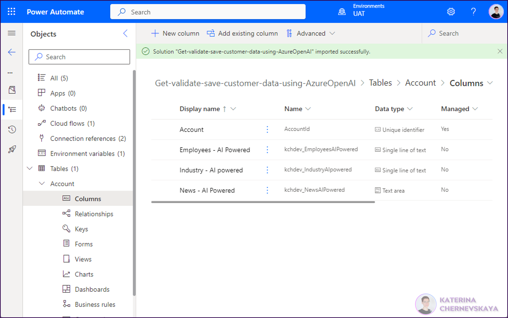

# Get, validate and save customer data to Dataverse using Azure Open AI

## Summary

This flow runs automatically when a new record is created in the Account table in the Dataverse. The flow gets the customer name from the record and uses the [custom connector](https://github.com/Katerina-Chernevskaya/Get-required-info-with-AzureOpenAI_CustomConnector) to send a pre-configured request to the Azure OpenAI service to get the number of employees, industry, and 3 news about the customer based solely on the company name. The received information is validated and stored in custom columns in the Account table in the Dataverse.

## Applies to

* [Microsoft Power Automate](https://docs.microsoft.com/power-automate/)
* [Azure OpenAI](https://learn.microsoft.com/en-us/azure/cognitive-services/openai/)
* [Dataverse](https://learn.microsoft.com/en-us/power-apps/maker/data-platform/)

## Compatibility

> Don't worry about this section, we'll take care of it. Unless you really want to...

## Authors

Solution|Author(s)
--------|---------
Get-validate-save-customer-data-using-AzureOpenAI | [Katerina Chernevskaya](https://github.com/Katerina-Chernevskaya) ([LinkedIn](https://www.linkedin.com/in/katerinachernevskaya/)), Awara IT Academy

## Version history

Version|Date|Comments
-------|----|--------
1.0|April 12, 2023|Initial release

## Features

This sample illustrates the following concepts:

* Use custom connector with pre-configured prompt to retrive required data about a customer
* Using Environment Variable to store api-key for easy parameter management
* Validate and clean information received from Azure OpenAI to store in Dataverse only verified values 

This solution includes 5 objects:
* Environment Variable `API key`
* Connection References `CustomerConnectorConnection` and `DataverseConnection`
* Flow `Get data for Account using Azure Open AI`
* Table `Account` with 4 colums:

## Prerequisites

* Azure subscription
* Azure OpenAI resource created and a model deployed using Azure OpenAI
* Installed the [Get required info with Azure OpenAI - custom connector](https://github.com/Katerina-Chernevskaya/Get-required-info-with-AzureOpenAI_CustomConnector)

Please follow steps described in the [Prerequisites](https://github.com/Katerina-Chernevskaya/Get-required-info-with-AzureOpenAI_CustomConnector#prerequisites) and [Minimal Path to Awesome](https://github.com/Katerina-Chernevskaya/Get-required-info-with-AzureOpenAI_CustomConnector#minimal-path-to-awesome) sections to install the [Get required info with Azure OpenAI - custom connector](https://github.com/Katerina-Chernevskaya/Get-required-info-with-AzureOpenAI_CustomConnector) before you proceed with the next steps.

## Minimal Path to Awesome

* Download the `.zip` from the `solution` folder
* Go to [Power Automate Studio](https://make.powerautomate.com/), go to `Solutions` and click `Import solution`
* Select the solution by clicking `Brows` button and press the `Next` button 

* Review all fields on the next screen and click `Next` button
* On the next screen configure connections - to the custom connector and to the Dataverse

Once both connections are configured - click `Next` button
* On the next screen provide the API key from your Azure OpenAI service and click the `Import` button

*After the solution will be imported successfully - you will see the notification and the solution will be available in the list.*

* Open the solution `Get-validate-save-customer-data-using-AzureOpenAI` and update Environmental Variable value with your API key.

*Once all steps will be completed you can use this flow for your Account table, for example for your CRM.*

## Disclaimer

**THIS CODE IS PROVIDED *AS IS* WITHOUT WARRANTY OF ANY KIND, EITHER EXPRESS OR IMPLIED, INCLUDING ANY IMPLIED WARRANTIES OF FITNESS FOR A PARTICULAR PURPOSE, MERCHANTABILITY, OR NON-INFRINGEMENT.**

## Help

> Note: don't worry about this section, we'll update the links.

We do not support samples, but we this community is always willing to help, and we want to improve these samples. We use GitHub to track issues, which makes it easy for  community members to volunteer their time and help resolve issues.

If you encounter any issues while using this sample, [create a new issue](https://github.com/pnp/powerautomate-samples/issues/new?assignees=&labels=Needs%3A+Triage+%3Amag%3A%2Ctype%3Abug-suspected&template=bug-report.yml&sample=YOURSAMPLENAME&authors=@YOURGITHUBUSERNAME&title=YOURSAMPLENAME%20-%20).

For questions regarding this sample, [create a new question](https://github.com/pnp/powerautomate-samples/issues/new?assignees=&labels=Needs%3A+Triage+%3Amag%3A%2Ctype%3Abug-suspected&template=question.yml&sample=YOURSAMPLENAME&authors=@YOURGITHUBUSERNAME&title=YOURSAMPLENAME%20-%20).

Finally, if you have an idea for improvement, [make a suggestion](https://github.com/pnp/powerautomate-samples/issues/new?assignees=&labels=Needs%3A+Triage+%3Amag%3A%2Ctype%3Abug-suspected&template=suggestion.yml&sample=YOURSAMPLENAME&authors=@YOURGITHUBUSERNAME&title=YOURSAMPLENAME%20-%20).

## For more information

- [Create your first flow](https://docs.microsoft.com/en-us/power-automate/getting-started#create-your-first-flow)
- [Microsoft Power Automate documentation](https://docs.microsoft.com/en-us/power-automate/)

