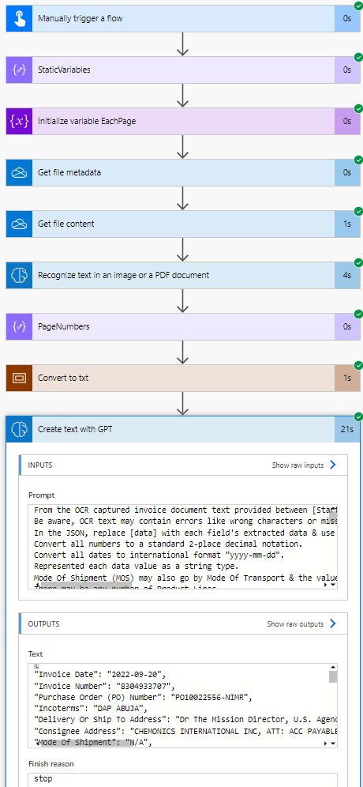

# Calendar Component

## Summary

Uses AI Builder's OCR for PDFs & Images to extract the text present in a file, replicates the file in a text (txt) format, then passes it off to a GPT prompt action for things like data extraction.

  
  

## Applies to

* [Microsoft Power Automate](https://docs.microsoft.com/powerautomate/)

## Compatibility

## Authors

Solution|Author(s)
--------|---------
Extract Data From PDFs And Images With GPT | [Tyler Kolota](https://github.com/takolota) ([@tylerkolota](https://www.linkedin.com/in/kolota) )

## Version history

Version|Date|Comments
-------|----|--------
2.7|August 30, 2023|Initial release

## Features

## Prerequisites

AI Builder credits

### Setting Up The Flow

To set up the flow, you can follow the video guide at https://powerusers.microsoft.com/t5/Power-Automate-Cookbook/Extract-Data-From-PDFs-and-Images-With-GPT/td-p/2201345

## Data Sources
 
OneDrive, SharePoint, or any other file source.

## Disclaimer

**THIS CODE IS PROVIDED *AS IS* WITHOUT WARRANTY OF ANY KIND, EITHER EXPRESS OR IMPLIED, INCLUDING ANY IMPLIED WARRANTIES OF FITNESS FOR A PARTICULAR PURPOSE, MERCHANTABILITY, OR NON-INFRINGEMENT.**

## Support

For questions & feedback, please visit https://powerusers.microsoft.com/t5/Power-Automate-Cookbook/Extract-Data-From-PDFs-and-Images-With-GPT/td-p/2201345 

