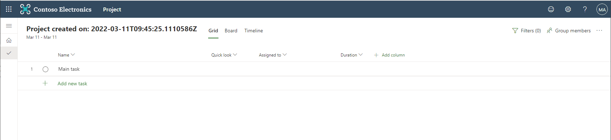
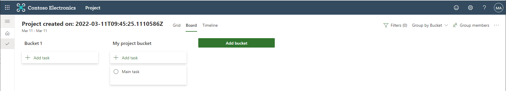
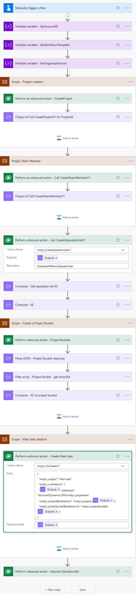

# Project for the web - Provision a project

## Summary

This flow creates a Project for the web with a task and a project bucket.

## Applies to

* [Microsoft Power Automate](https://docs.microsoft.com/power-automate/)
* [Project for the web](https://support.microsoft.com/en-us/project)

## Compatibility

Required to allow changes/updates to Project task table [Restricted dataverse tables](https://docs.microsoft.com/en-us/powerapps/maker/data-platform/data-platform-restricted-entities) 

## Authors

Solution|Author(s)
--------|---------
ProjectForTheWeb-Provisioning | [Lenard Schockaert](https://github.com/Lschockaert)

## Version history

Version|Date|Comments
-------|----|--------
1.0|March 11, 2021|Initial release

## Features

> Description of the sample with possible additional details than in short summary.

This sample illustrates the following concepts:

* How to create a project
* How to create a project bucket inside of this project
* How to create a project task inside of the bucket

This sample is built using the following documentation:
[Use Project schedule APIs with Power Automate](https://docs.microsoft.com/en-us/dynamics365/project-operations/project-management/scheduling-apis-powerautomate)

And a more complete and extensive flow is available on this blog if you plan to use the 'real' D365 project operations projects: [daytodaydynamics365](https://daytodaydynamics365.com/project-operations-and-project-for-the-web-schedule-api-guide-for-power-automate-users/)

## Prerequisites

## Minimal Path to Awesome

* [Download](./solution/ProjectForTheWeb-Provisioning.zip) the `.zip` from the `solution` folder
* Browse to [Power Automate](https://flow.microsoft.com/manage/environments) and select the environment where you wish to import the sample
* From the toolbar, select **Import**
* In the **Import package** page, select **Upload** and choose the `.zip` file containing the sample flow.
* Select **Import**
* Change the initialize variables in the top of the flow

## Disclaimer

**THIS CODE IS PROVIDED *AS IS* WITHOUT WARRANTY OF ANY KIND, EITHER EXPRESS OR IMPLIED, INCLUDING ANY IMPLIED WARRANTIES OF FITNESS FOR A PARTICULAR PURPOSE, MERCHANTABILITY, OR NON-INFRINGEMENT.**

## Help

> Note: don't worry about this section, we'll update the links.

We do not support samples, but we this community is always willing to help, and we want to improve these samples. We use GitHub to track issues, which makes it easy for  community members to volunteer their time and help resolve issues.

If you encounter any issues while using this sample, [create a new issue](https://github.com/pnp/powerautomate-samples/issues/new?assignees=&labels=Needs%3A+Triage+%3Amag%3A%2Ctype%3Abug-suspected&template=bug-report.yml&sample=YOURSAMPLENAME&authors=@YOURGITHUBUSERNAME&title=YOURSAMPLENAME%20-%20).

For questions regarding this sample, [create a new question](https://github.com/pnp/powerautomate-samples/issues/new?assignees=&labels=Needs%3A+Triage+%3Amag%3A%2Ctype%3Abug-suspected&template=question.yml&sample=YOURSAMPLENAME&authors=@YOURGITHUBUSERNAME&title=YOURSAMPLENAME%20-%20).

Finally, if you have an idea for improvement, [make a suggestion](https://github.com/pnp/powerautomate-samples/issues/new?assignees=&labels=Needs%3A+Triage+%3Amag%3A%2Ctype%3Abug-suspected&template=suggestion.yml&sample=YOURSAMPLENAME&authors=@YOURGITHUBUSERNAME&title=YOURSAMPLENAME%20-%20).

## For more information

- [Create your first flow](https://docs.microsoft.com/en-us/power-automate/getting-started#create-your-first-flow)
- [Microsoft Power Automate documentation](https://docs.microsoft.com/en-us/power-automate/)

