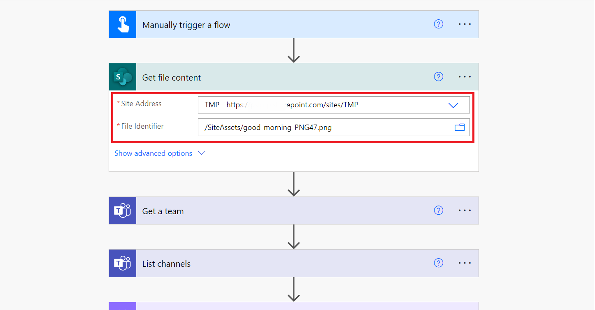
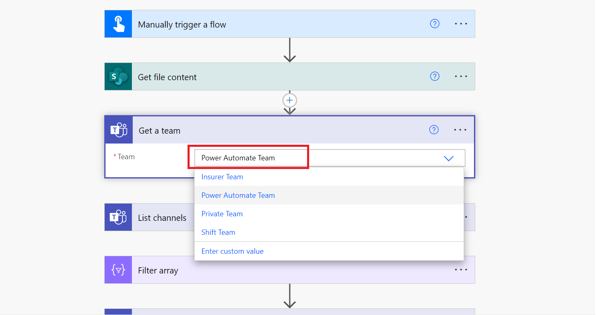

# Send Inline Image In Teams Channel

## Summary

This sample gets the image from SharePoint document library and post it on **Microsoft Teams** channel using **Power Automate**. The flow utilizes standard **Send Microsoft graph request** action to overcome the payload size limit of 28 KB.

## Applies to

* [Power Automate](https://docs.microsoft.com/power-automate/)
* [Microsoft Teams](https://learn.microsoft.com/en-us/microsoftteams/)

## Compatibility

## Authors

Solution|Author(s)
--------|---------
Send inline image in team message | [Manish Solanki](https://github.com/Solanki-Manish) ([@Manish Solanki](https://www.linkedin.com/in/manish-solanki-1058b7a))

## Version history

Version|Date|Comments
-------|----|--------
1.0|May 21, 2024|Initial release

## Features

This sample illustrates the following concepts:

* Post embed image in MS Teams Channel message
* Overcome the payload size limit (28 KB)
* Send a Microsoft Graph HTTP request using standard action 
* Expression

## Prerequisites

* This Flow requires an image to be present in SharePoint document library (inside site asset).
* A Microsoft Teams with a channel where image needs to be shared via message.

## Minimal Path to Awesome

### Import Solution

1.   Download the solution found under the "solution" folder
1.   Import the Flow Solution. Open  [https://make.powerautomate.com/](https://make.powerautomate.com/). Open **My Flows**, **Import Package(Legacy)**.
1.   Browse to the file you downloaded and select **Upload**.
1.   In the **Import package** screen, under **Review Package Content** click **Select during import** and choose an existing connection or create a new connections for "SharePoint" and "Microsoft Teams"
     
1.   Once complete, select **Import**.

### Configure Flow

1. Once the solution is imported, edit it
1. Select **Get file content** action and replace the **Site Address** and the **File Identifier** to point to your SharePoint site and image file.
   
1. Select **Get team** action and choose a team from the drop down.
   
1. Save and test the flow.

## Disclaimer

**THIS CODE IS PROVIDED *AS IS* WITHOUT WARRANTY OF ANY KIND, EITHER EXPRESS OR IMPLIED, INCLUDING ANY IMPLIED WARRANTIES OF FITNESS FOR A PARTICULAR PURPOSE, MERCHANTABILITY, OR NON-INFRINGEMENT.**

## Help

We do not support samples, but we this community is always willing to help, and we want to improve these samples. We use GitHub to track issues, which makes it easy for  community members to volunteer their time and help resolve issues.

If you encounter any issues while using this sample, [create a new issue](https://github.com/pnp/powerautomate-samples/issues/new?assignees=&labels=Needs%3A+Triage+%3Amag%3A%2Ctype%3Abug-suspected&template=bug-report.yml&sample=YOURSAMPLENAME&authors=@YOURGITHUBUSERNAME&title=YOURSAMPLENAME%20-%20).

For questions regarding this sample, [create a new question](https://github.com/pnp/powerautomate-samples/issues/new?assignees=&labels=Needs%3A+Triage+%3Amag%3A%2Ctype%3Abug-suspected&template=question.yml&sample=YOURSAMPLENAME&authors=@YOURGITHUBUSERNAME&title=YOURSAMPLENAME%20-%20).

Finally, if you have an idea for improvement, [make a suggestion](https://github.com/pnp/powerautomate-samples/issues/new?assignees=&labels=Needs%3A+Triage+%3Amag%3A%2Ctype%3Abug-suspected&template=suggestion.yml&sample=YOURSAMPLENAME&authors=@YOURGITHUBUSERNAME&title=YOURSAMPLENAME%20-%20).

## For more information

- [Create your first flow](https://docs.microsoft.com/en-us/power-automate/getting-started#create-your-first-flow)
- [Microsoft Power Automate documentation](https://docs.microsoft.com/en-us/power-automate/)

---
