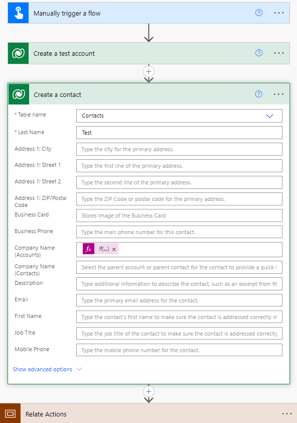
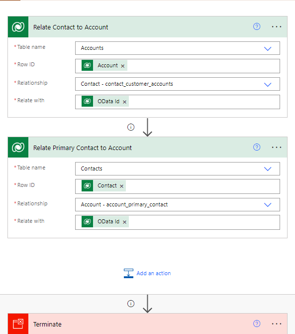

# Pattern: Setting Dataverse Lookups

## Summary

 A pattern that shows two ways to set a Dataverse lookup field with both an expression and the 'relate rows' action. Taylor Becktold's original blogpost can be found here: https://azwhizkid.com/dataverse-power-automate-lookups/

## Applies to

* [Microsoft Dataverse](https://learn.microsoft.com/en-us/power-apps/maker/data-platform/)
* [Microsoft Power Automate](https://docs.microsoft.com/power-automate/)
* [Microsoft Logic Apps](https://learn.microsoft.com/en-us/azure/logic-apps/logic-apps-overview)

## Compatibility

> Don't worry about this section, we'll take care of it. Unless you really want to...

## Authors

Solution|Author(s)
--------|---------
send-name-pronunciation-recording-to-library | [Taylor Becktod](https://github.com/TBecktold) ([@BecktoldTaylor](https://twitter.com/BecktoldTaylor)), RSM US LLP

## Version history

Version|Date|Comments
-------|----|--------
1.0|December 15, 2022|Initial release

## Features

Two simple patterns for setting lookups in Dataverse using expressions and the 'Relate '
This sample illustrates the following concepts:

* Using expressions to populate a lookup from dynamic content if the lookup has data in it
* Using the 'Relate rows' action to populate lookups without the need for the /entityset() syntax

## Prerequisites

A Dataverse database with standard Account and Contact tables.

## Data Sources

This flow creates records in Dataverse. You will need a connection to Dataverse to run this flow.

## Minimal Path to Awesome

* [Download](./solution/set-dataverse-lookups) the `.zip` from the `solution` folder
* Browse to [Power Automate](https://flow.microsoft.com/manage/environments) and select the environment where you wish to import the sample
* From the toolbar, select **Import**
* In the **Import package** page, select **Upload** and choose the `.zip` file containing the sample flow.
* Select **Import**
* ...

## Using the Source

  You can also use the source and create your own `.zip` file by following these steps:

* ...

## Disclaimer

**THIS CODE IS PROVIDED *AS IS* WITHOUT WARRANTY OF ANY KIND, EITHER EXPRESS OR IMPLIED, INCLUDING ANY IMPLIED WARRANTIES OF FITNESS FOR A PARTICULAR PURPOSE, MERCHANTABILITY, OR NON-INFRINGEMENT.**

## Help

> Note: don't worry about this section, we'll update the links.

We do not support samples, but we this community is always willing to help, and we want to improve these samples. We use GitHub to track issues, which makes it easy for  community members to volunteer their time and help resolve issues.

If you encounter any issues while using this sample, [create a new issue](https://github.com/pnp/powerautomate-samples/issues/new?assignees=&labels=Needs%3A+Triage+%3Amag%3A%2Ctype%3Abug-suspected&template=bug-report.yml&sample=YOURSAMPLENAME&authors=@YOURGITHUBUSERNAME&title=YOURSAMPLENAME%20-%20).

For questions regarding this sample, [create a new question](https://github.com/pnp/powerautomate-samples/issues/new?assignees=&labels=Needs%3A+Triage+%3Amag%3A%2Ctype%3Abug-suspected&template=question.yml&sample=YOURSAMPLENAME&authors=@YOURGITHUBUSERNAME&title=YOURSAMPLENAME%20-%20).

Finally, if you have an idea for improvement, [make a suggestion](https://github.com/pnp/powerautomate-samples/issues/new?assignees=&labels=Needs%3A+Triage+%3Amag%3A%2Ctype%3Abug-suspected&template=suggestion.yml&sample=YOURSAMPLENAME&authors=@YOURGITHUBUSERNAME&title=YOURSAMPLENAME%20-%20).

## For more information

- [Create your first flow](https://docs.microsoft.com/en-us/power-automate/getting-started#create-your-first-flow)
- [Microsoft Power Automate documentation](https://docs.microsoft.com/en-us/power-automate/)

