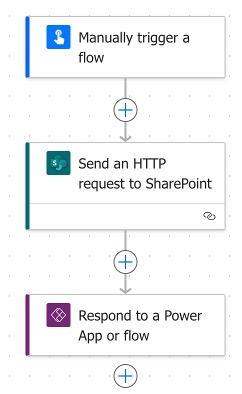

# Update "Created by" in a Microsoft List

## Summary

This Power Automate flow updates the “Created By” field of a Microsoft List item, replacing the account with a specified user based on their email address, using an HTTP request to SharePoint.



## Applies to


## Compatibility

 

## Authors

| Solution                              | Author                                        |
| ------------------------------------- | --------------------------------------------- |
| Sharepoint - List - Update Created By | [Glynn Pearson](https://github.com/Glynnryan) |

## Version history

| Version | Date               | Comments        |
| ------- | ------------------ | --------------- |
| 1.0.0.0 | September 18, 2024 | Initial release |

## Prerequisites

- **Microsoft Lists**
  - A configured Microsoft List

## Minimal path to awesome

> [!NOTE]
> My solution uses a flow created within a Solution in Power Automate. You can still achieve the end goal by following the steps below in a dedicated flow. However, if you're not using solutions, I would recommend starting to do so, as there are several benefits, such as running a child flow.

> [!TIP]
> For more information on Solutions, you can click [here](https://learn.microsoft.com/en-us/power-automate/overview-solution-flows).

### Steps
1. Sign in to [Power Automate](https://make.powerautomate.com/).
2. In the left-hand menu, select **Solutions**.
3. Choose the solution where you want to create the automation, or [create a new solution](https://learn.microsoft.com/en-us/power-automate/overview-solution-flows).
4. Create a new automation:
  - In the top menu, select **New** > **Automation** > **Cloud Flow** > **Instant**.

    

  - Enter a **Flow name**. (I called mine "Update Created By". Original, right? 🤓)
  - Select **Manually trigger a flow** as the trigger.
  - Select **Create**.

    

5. Select **Manually trigger a flow** and add the following inputs:

|  Type  |       Name       |                 Description                  |
| ------ | ---------------- | -------------------------------------------- |
|  Text  |    List Name     |          Name of the list to update          |
| Number |     List ID      |            List item ID to update            |
|  Text  | Created By Email | Email address of the person to set as Author |
|  Text  |   Site Address   |            Site address of the list          |

  

6. Add a **Send an HTTP request to SharePoint** action.

  

> [!TIP] 
> You can search for "HTTP" in the search box to find this action quickly.

7. Configure the **Send an HTTP request to SharePoint** action as follows:

- **Site Address**
  - Select the **Site Address** dynamic content created in step 5, or enter the relevant SharePoint site address.

> [!TIP] 
> If you want this automation to work dynamically across multiple SharePoint sites, add the **Site Address** at step 5. Alternatively, you can set this as a fixed value if your use case means the SharePoint site will not change.

- **Method**
  - Post

- **Uri**

``` HTML
_api/web/lists/getbytitle('List Name')/items('ID')/validateUpdateListItem
```
  
> [!NOTE]
> - If you've followed the exact sequence in step 5, you can use [Uri-Sample.html](sourcecode/Uri-Sample.html) without modification.
> - If you configured your own inputs in Step 5, adjust [Uri.html](sourcecode/Uri.html) as needed.

- **Body**

``` JSON
{
  "formValues":[
  {
    "FieldName": "Author",
    "FieldValue": "[{'Key':'i:0#.f|membership|user@example.com'}]"
  }
  ]
}
```

> [!NOTE]
> - If you've followed the exact sequence in step 5, you can use [Body-Sample.json](sourcecode/Body-Sample.json) without modification.
> - If you configured your own inputs in Step 5, adjust [Body.json](sourcecode/Body.json) as needed.

  

8. Add a **Respond to a Power App or flow** action.

  

  > [!TIP]
  > Add an **Output**, with the **Type** of **Text** and **Value** of "Complete" to parse this status back to your previous flow.

9. Save and **publish** your automation.
10. Select **Back** at the top left corner of your screen to return to the automation's overview screen.
11. **Edit** the **Run only users**

> [!IMPORTANT]
> This is to ensure that the automation can be run when using the "Run a child flow" action.

- Select the dropdown arrow below the **SharePoint** connection.
  - Select a connection to use.
  - Select **Save**
And that’s it! Now, whenever you need to update the “Created By” field in a Microsoft List item, use the **Run a Child Flow** action, select this automation, and input your dynamic content into the fields you set up in step 5.

### Using the solution zip

* [Download](./solution/UpdateCreatedBy_1_0_0_1.zip) the `.zip` from the `solution` folder
* Within **Power Apps Studio**, import the solution `.zip` file using **Solutions** > **Import Solution** and select the `.zip` file you just packed.
* Open the app in edit mode and make sure the data source **Data source name** is connected correctly.

### Using the source code

You can also use the [Power Apps CLI](https://docs.microsoft.com/powerapps/developer/data-platform/powerapps-cli) to pack the source code by following these steps:

* Clone the repository to a local drive
* Pack the source files back into a solution `.zip` file:

  ```bash
  pac solution pack --zipfile pathtodestinationfile --folder pathtosourcefolder --processCanvasApps
  ```

  Making sure to replace `pathtosourcefolder` to point to the path to this sample's `sourcecode` folder, and `pathtodestinationfile` to point to the path of this solution's `.zip` file (located under the `solution` folder)
* Within **Power Apps Studio**, import the solution `.zip` file using **Solutions** > **Import Solution** and select the `.zip` file you just packed.

## Features

I have several Power Automate flows that create items in various Microsoft Lists within the same SharePoint site using a service account. As a result, these list items have a "Created By" value that reflects the service account's name.

While this is acceptable in some instances, there are cases where I need a specific individual to appear as the author of the item. For example, when a Microsoft Form triggers my flow, I may want the list item to reflect the form responder as the list item author.

This Power Automate flow updates the “Created By” field in Microsoft Lists, replacing the default account with a specified user based on their email address, using an HTTP request to SharePoint.

## Help

We do not support samples, but this community is always willing to help, and we want to improve these samples. We use GitHub to track issues, which makes it easy for  community members to volunteer their time and help resolve issues.

If you encounter any issues while using this sample, you can [create a new issue](https://github.com/pnp/powerapps-samples/issues/new?assignees=&labels=Needs%3A+Triage+%3Amag%3A%2Ctype%3Abug-suspected&template=bug-report.yml&sample=Sharepoint%20-%20List%20-%20Update%20Created%20By&authors=@Glynnryan&title=Sharepoint%20-%20List%20-%20Update%20Created%20By%20-%20).

For questions regarding this sample, [create a new question](https://github.com/pnp/powerapps-samples/issues/new?assignees=&labels=Needs%3A+Triage+%3Amag%3A%2Ctype%3Abug-suspected&template=question.yml&sample=Sharepoint%20-%20List%20-%20Update%20Created%20By&authors=@Glynnryan&title=Sharepoint%20-%20List%20-%20Update%20Created%20By%20-%20).

Finally, if you have an idea for improvement, [make a suggestion](https://github.com/pnp/powerapps-samples/issues/new?assignees=&labels=Needs%3A+Triage+%3Amag%3A%2Ctype%3Abug-suspected&template=suggestion.yml&sample=Sharepoint%20-%20List%20-%20Update%20Created%20By&authors=@Glynnryan&title=Sharepoint%20-%20List%20-%20Update%20Created%20By%20-%20).

## Disclaimer

**THIS CODE IS PROVIDED *AS IS* WITHOUT WARRANTY OF ANY KIND, EITHER EXPRESS OR IMPLIED, INCLUDING ANY IMPLIED WARRANTIES OF FITNESS FOR A PARTICULAR PURPOSE, MERCHANTABILITY, OR NON-INFRINGEMENT.**

## Post Script

I stumbled onto a Microsoft Community post titled "[Update 'Created By' and 'Modified By' fields.](https://techcommunity.microsoft.com/t5/power-apps-and-power-automate-in/update-created-by-and-modified-by-fields/m-p/3672675/highlight/true#M6072)", with an answer by [Rob Elliott](https://techcommunity.microsoft.com/t5/user/viewprofilepage/user-id/174092#profile) which gave me the idea and framework for my solution.

### Acknowledgements

- [Rob Elliott](https://techcommunity.microsoft.com/t5/user/viewprofilepage/user-id/174092#profile)


