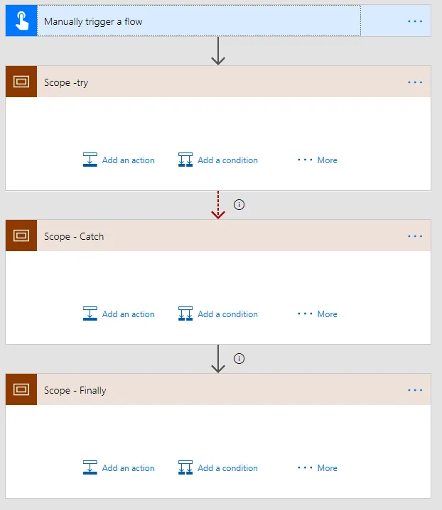

# Pattern: Try-Catch-Finally
## Summary

A pattern for Try-Catch-Finally. Pieter Veenstra's original blog post can be found here: https://sharepains.com/2018/02/07/power-automate-try-catch-finally-flow/

## Applies to

* [Microsoft Power Automate](https://docs.microsoft.com/en-us/power-automate)
* [Azure Logic Apps](https://docs.microsoft.com/en-us/azure/logic-apps/logic-apps-overview)

## Solution

Solution|Author(s)
--------|---------
PatternTry-Catch-Finally | [Remy Blok](https://github.com/remyblok), Prodware; Pieter Veenstra

## Version history

Version|Date|Comments
-------|----|--------
1.0|May 01, 2021|Initial release

## Features
Simple pattern for creating a try-catch-finally block using Scopes and Run After configuration.

* Try-block: contains the actions you with to execute and might fail. 
* Catch-block: these actions are only executed if the try-block fails. You can add special actions here to have the error that has occured.
* Finally-block: actions in this block are always executed, either if the Try-block has succeeded, or if the Try-block has failed and the Catch-block has been executed. Also if the Catch-block failed the Finally-block will still execute.

See the original blog post from Pieter Veenstra for more information: https://sharepains.com/2018/02/07/power-automate-try-catch-finally-flow/

## Disclaimer

**THIS CODE IS PROVIDED *AS IS* WITHOUT WARRANTY OF ANY KIND, EITHER EXPRESS OR IMPLIED, INCLUDING ANY IMPLIED WARRANTIES OF FITNESS FOR A PARTICULAR PURPOSE, MERCHANTABILITY, OR NON-INFRINGEMENT.**

---

## Minimal Path to Awesome

* [Download](solution/PatternTry-Catch-Finally.zip) the `.zip` from the `solution` folder
* [Import](https://flow.microsoft.com/en-us/blog/import-export-bap-packages/) the `.zip` file using **My Flows** > **Import** > **Upload** within Microsoft Flow.

## Support

> Note: don't worry about this section, we'll update the links.

While we don't support samples, if you encounter any issues while using this sample, you can [create a new issue](https://github.com/pnp/powerautomate-samples/issues/new?assignees=&labels=Needs%3A+Triage+%3Amag%3A%2Ctype%3Abug-suspected&template=bug-report.yml&sample=YOURSAMPLENAME&authors=@YOURGITHUBUSERNAME&title=YOURSAMPLENAME%20-%20).

For questions regarding this sample, [create a new question](https://github.com/pnp/powerautomate-samples/issues/new?assignees=&labels=Needs%3A+Triage+%3Amag%3A%2Ctype%3Abug-suspected&template=question.yml&sample=YOURSAMPLENAME&authors=@YOURGITHUBUSERNAME&title=YOURSAMPLENAME%20-%20).

Finally, if you have an idea for improvement, [make a suggestion](https://github.com/pnp/powerautomate-samples/issues/new?assignees=&labels=Needs%3A+Triage+%3Amag%3A%2Ctype%3Abug-suspected&template=suggestion.yml&sample=YOURSAMPLENAME&authors=@YOURGITHUBUSERNAME&title=YOURSAMPLENAME%20-%20).

## For more information

- [Create your first flow](https://docs.microsoft.com/en-us/power-automate/getting-started#create-your-first-flow)
- [Microsoft Power Automate documentation](https://docs.microsoft.com/en-us/power-automate/)

