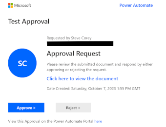
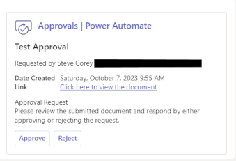
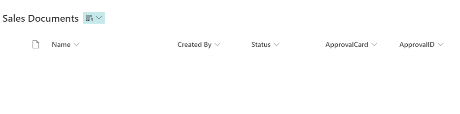

# Approval Reminders

## Summary

This sample sends an approval and reminders to a user via Teams until they respond to the approval. It will retrigger itself as needed to overcome timeout limitations.

## Applies to

*   [Microsoft Power Automate](https://docs.microsoft.com/power-automate/)

## Compatibility

## Authors

| Solution | Author(s) |
| --- | --- |
| approval-reminders | [Steve Corey](https://github.com/stevecorey365) ([@stevecorey365](https://www.twitter.com/stevecorey365) )

## Version history

| Version | Date | Comments |
| --- | --- | --- |
| 1.0 | October 17, 2023 | Initial release |

## Features

This sample demonstrates the following concepts:

*   Creating an approval
*   Sending reminders for the approval via Teams adaptive cards

## Minimal Path to Awesome

### Create SharePoint List

Before you can use this sample flow, you'll need to create a SharePoint library with the following custom columns:

| Name | Type |Required
|---|---|---|
|ApprovalID|Single line of text|No
|ApprovalCard|Multiple lines of text|No
|Status|Choice|Yes

The library will look similar to this. Note that the ApprovalID and ApprovalCard fields don't have to be present on the view:
  

### Import Solution

1.   Download the solution found under the `solution` folder here: [Approval Reminders Zip](./solution/SampleApprovalReminders_1_0_0_2.zip)
1.   Import the Flow Solution. Open  [https://make.powerautomate.com/](https://make.powerautomate.com/). Open **Solutions**, **Import**.
1.   Browse to the file you downloaded and select **Next**.
1.   In the **Import a solution** screen, select the connections you wish to use for the solution or create new connections.
1.   In the **Environment Variables** screen, select the site and library name of the library you wish to create approvals on.
1.   Once complete, select **Import**.

## Disclaimer

**THIS CODE IS PROVIDED** _**AS IS**_ **WITHOUT WARRANTY OF ANY KIND, EITHER EXPRESS OR IMPLIED, INCLUDING ANY IMPLIED WARRANTIES OF FITNESS FOR A PARTICULAR PURPOSE, MERCHANTABILITY, OR NON-INFRINGEMENT.**
