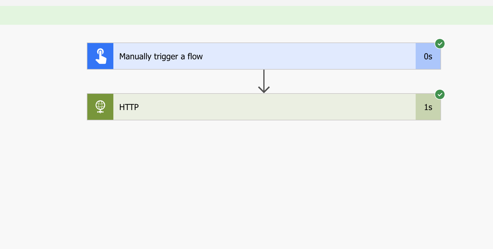
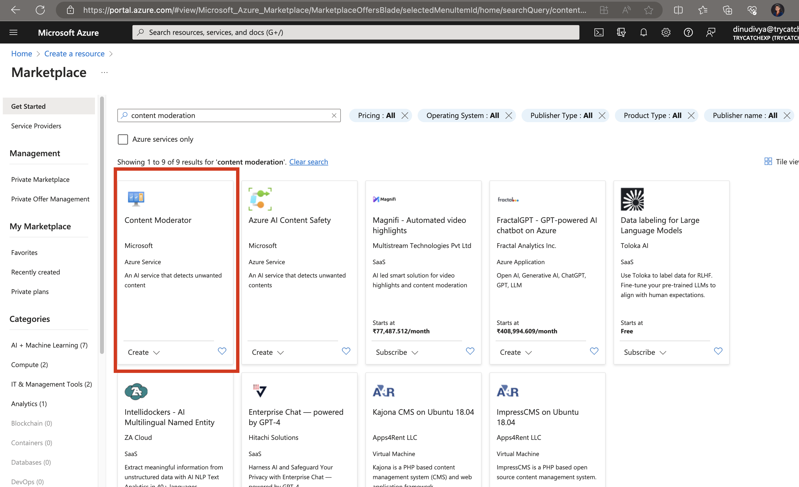
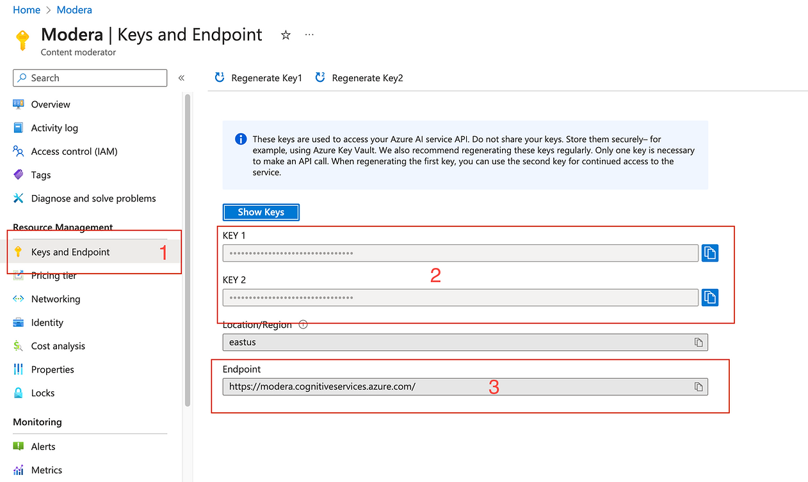

# Azure HTTP Key Vault

## Summary

Demonstrates how Content Moderation Azure API can be used with the power automate

## Applies to

* [Microsoft Power Automate](https://docs.microsoft.com/en-us/power-automate/getting-started)
* [Azure Logic Apps](https://docs.microsoft.com/en-us/azure/logic-apps/logic-apps-overview)

## Compatibility

## Authors

Solution|Author(s)
--------|---------
azure-content-moderation-text | [Divya Akula](https://github.com/divya-akula)

## Version history

Version|Date|Comments
-------|----|--------
1.0|Aug 19, 2023|Initial release

## Features
Azure Content moderation helps to streamline or moderate the data which includes text , image and video . These services can be used by any application by the API endpoints provided by azure.

The flow demonstrates how to moderate text in two easy steos

Prerequisites:
This app uses Content Moderation resource and Http Premium Connector.
1. User has to navigate to [Azure Portal](https://portal.azure.com)
2. Create new resource for Content Moderation , 

3. Once the resource is provisioned,navigate to the **Resource** > **Content moderation* > **Keys and Endpoint** 

4. Using the Keys and endpoint invoke the flow with the appropriate parametess

## Minimal Path to Awesome

* [Download](solution/ModerateText.zip) the `.zip` from the `solution` folder
* [Import](https://flow.microsoft.com/en-us/blog/import-export-bap-packages/) the `.zip` file using **My Flows** > **Import** > **Upload** within Microsoft Flow.

## Disclaimer

**THIS CODE IS PROVIDED *AS IS* WITHOUT WARRANTY OF ANY KIND, EITHER EXPRESS OR IMPLIED, INCLUDING ANY IMPLIED WARRANTIES OF FITNESS FOR A PARTICULAR PURPOSE, MERCHANTABILITY, OR NON-INFRINGEMENT.**

## Help

We do not support samples, but we this community is always willing to help, and we want to improve these samples. We use GitHub to track issues, which makes it easy for  community members to volunteer their time and help resolve issues.

If you encounter any issues while using this sample, [create a new issue](https://github.com/pnp/powerautomate-samples/issues/new?assignees=&labels=Needs%3A+Triage+%3Amag%3A%2Ctype%3Abug-suspected&template=bug-report.yml&sample=always-reply-to-request&authors=@remyblok&title=always-reply-to-request%20-%20).

For questions regarding this sample, [create a new question](https://github.com/pnp/powerautomate-samples/issues/new?assignees=&labels=Needs%3A+Triage+%3Amag%3A%2Ctype%3Abug-suspected&template=question.yml&sample=always-reply-to-request&authors=@remyblok&title=always-reply-to-request%20-%20).

Finally, if you have an idea for improvement, [make a suggestion](https://github.com/pnp/powerautomate-samples/issues/new?assignees=&labels=Needs%3A+Triage+%3Amag%3A%2Ctype%3Abug-suspected&template=suggestion.yml&sample=always-reply-to-request&authors=@remyblok&title=always-reply-to-request%20-%20).

## For more information

- [Create your first flow](https://docs.microsoft.com/en-us/power-automate/getting-started#create-your-first-flow)
- [Microsoft Power Automate documentation](https://docs.microsoft.com/en-us/power-automate/)

