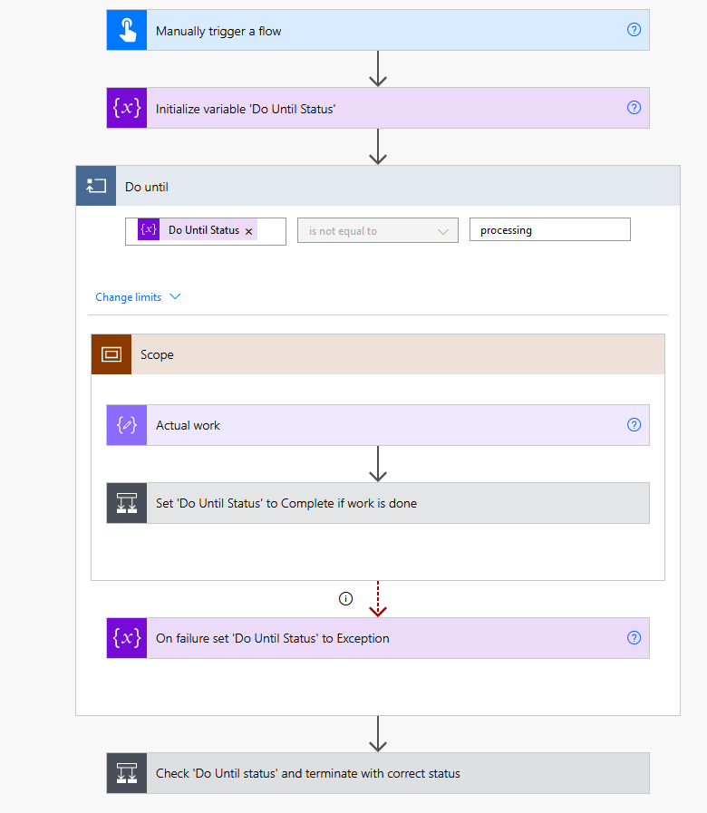

# Pattern: Exception handing in 'Do until'-loop

## Summary

A pattern for breaking out of a 'Do Until'-loop in Power Automate when an exception occurs.

## Applies to

* [Microsoft Power Automate](https://docs.microsoft.com/en-us/power-automate/getting-started)
* [Azure Logic Apps](https://docs.microsoft.com/en-us/azure/logic-apps/logic-apps-overview)

## Compatibility

## Authors

Solution|Author(s)
--------|---------
exception-handing-in-do-until-loop | [Remy Blok](https://github.com/remyblok), Prodware

## Version history

Version|Date|Comments
-------|----|--------
1.0|May 01, 2021|Initial release

## Features

Power Automate has the ['Do Until' action](https://docs.microsoft.com/en-us/azure/logic-apps/logic-apps-control-flow-loops#until-loop), which allows the actions within to be repeated until a condition is met. You can configure how often and how long this is repeated. This way you can create long running processes (up to 30 days). By default, if an error occurs in the loop then it just continues with the next cycle in the loop.

If an unexpected error, i.e. an exception, would occur in a long running loop, it is not easily visible in Power Automate. Only after the run has fully finished you see the results. So, most of the time it is preferred to stop the loop if an exception has occurred.

In this sample we use a Scope inside the 'Do Until'-loop. Now, a Scope does fail immediately if one of the child actions fail. By setting the 'Configure run after' to run only on error of the Scope we can set a variable only if an error has occurred.

Just as in de documentation we use a variable in the condition of the loop to check if the loop should continue. This variable is also used after the loop to determine if the loop has been successful or resulted in an exception. In this sample it is used to terminate the Flow with the correct status. This makes it easy to see if a Flow run has failed or not.

Note: there is a clear distinction between an expected and unexpected error. For example, if you call a web service and it is documented a HTTP 404 status is returned, then Power Automate will see this as an error, but we can expect this to happen and should handle this gracefully. On the other hand, if a HTTP 500 error occurs then this is unexpected and an exception, the flow should now probably fail so you can investigate whats wrong as soon as possible.

Note 2: Make sure that you setup the correct retry policies on the individual actions. This makes sure that intermittent failures caused by, for example, network issues or a server with a hiccup do not result in errors in your Flow. See [Retry policy in Logic Apps](https://docs.microsoft.com/en-us/azure/logic-apps/logic-apps-exception-handling) for more information.

## Minimal Path to Awesome

* [Download](solution/PatternExceptionHandingInDoUntilLoop.zip) the `.zip` from the `solution` folder
* [Import](https://flow.microsoft.com/en-us/blog/import-export-bap-packages/) the `.zip` file using **My Flows** > **Import** > **Upload** within Microsoft Flow.

## Disclaimer

**THIS CODE IS PROVIDED *AS IS* WITHOUT WARRANTY OF ANY KIND, EITHER EXPRESS OR IMPLIED, INCLUDING ANY IMPLIED WARRANTIES OF FITNESS FOR A PARTICULAR PURPOSE, MERCHANTABILITY, OR NON-INFRINGEMENT.**

## Support

While we don't support samples, if you encounter any issues while using this sample, you can [create a new issue](https://github.com/pnp/powerautomate-samples/issues/new?assignees=&labels=Needs%3A+Triage+%3Amag%3A%2Ctype%3Abug-suspected&template=bug-report.yml&sample=exception-handing-in-do-until-loop&authors=@remyblok&title=exception-handing-in-do-until-loop%20-%20).

For questions regarding this sample, [create a new question](https://github.com/pnp/powerautomate-samples/issues/new?assignees=&labels=Needs%3A+Triage+%3Amag%3A%2Ctype%3Abug-suspected&template=question.yml&sample=exception-handing-in-do-until-loop&authors=@remyblok&title=exception-handing-in-do-until-loop%20-%20).

Finally, if you have an idea for improvement, [make a suggestion](https://github.com/pnp/powerautomate-samples/issues/new?assignees=&labels=Needs%3A+Triage+%3Amag%3A%2Ctype%3Abug-suspected&template=suggestion.yml&sample=exception-handing-in-do-until-loop&authors=@remyblok&title=exception-handing-in-do-until-loop%20-%20).

## For more information

- [Create your first flow](https://docs.microsoft.com/en-us/power-automate/getting-started#create-your-first-flow)
- [Microsoft Power Automate documentation](https://docs.microsoft.com/en-us/power-automate/)

