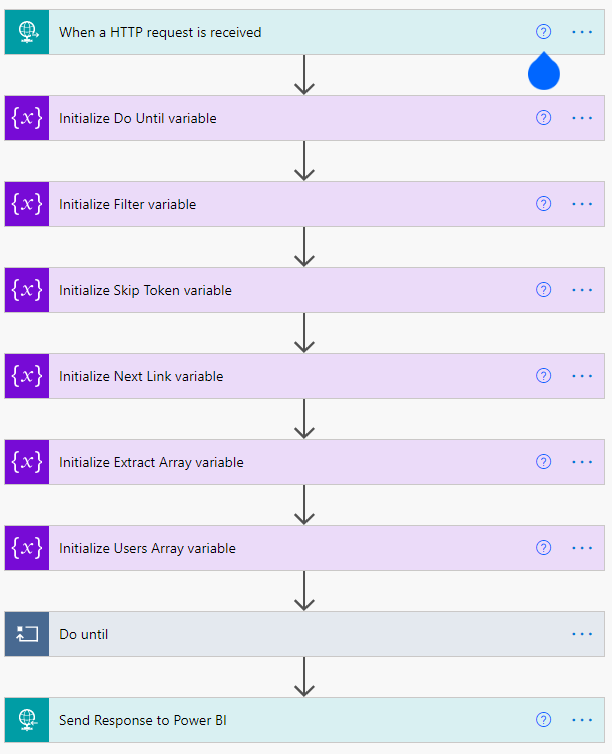
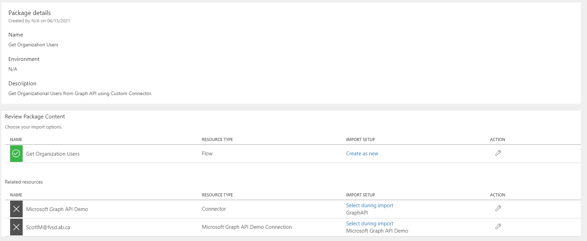
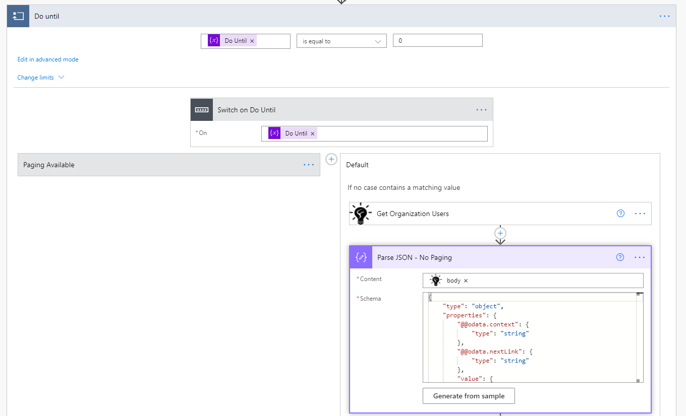

# Get Graph API Data within Power BI Reports

## Summary

This sample project enables Graph API data to be refreshed within the Power BI Service. 

## Applies to

*   [Microsoft Power Automate](https://docs.microsoft.com/power-automate/)
*   [Microsoft Power BI](https://docs.microsoft.com/en-us/power-bi/)

## Compatibility

## Authors

| Solution | Author(s) |
| --- | --- |
| graph_api_in_power_bi | [Scott McKenzie](https://github.com/skmckenFVSD) ([@365EDUBI](https://twitter.com/365EDUBI) )

## Version history

| Version | Date | Comments |
| --- | --- | --- |
| 1.0 | June 20th, 2021 | Initial release |

## Features

This sample demonstrates the following concepts:

*   Use of Power BI Report / Power BI Data Flows to trigger Power Automate
*   Development of a Custom Connector to connect to Microsoft Graph API
*   Graph API Paging
*   Returning Data to Power BI Report / Power BI Dataflow

## Minimal Path to Awesome
*   [Configure Azure Application and Import Custom Connector](customconnector.md "Configure Azure Application and Import Custom Connector")
*   [Download](solution/GetOrganizationUsers.zip) the `GetOrganizationUsers.zip` from the `solution` folder
*   [Import](https://flow.microsoft.com/en-us/blog/import-export-bap-packages/) the `GetOrganizationUsers.zip` file using **My Flows** > **Import** > **Upload** within Microsoft Flow.
*   [Download](powerbi/getorganizationusers.pbit) the `getorganizationusers.pbit` from the `powerbi` folder

### Import Get Organization Users Solution

1.   Download the solution found under the `solution` folder
1.   Import the Flow Solution. Open  [https://make.powerautomate.com/](https://make.powerautomate.com/). Open **My Flows**, **Import**.
1.   Browse to the file you downloaded and select **Upload**.
1.   In the **Import package** screen, select the **Microsoft Graph API Demo**, under **Related Resources** > **Select during import** and select the Custom Connector previously created.
1.  select the **Microsoft Graph API Demo Connection**, under **Related Resources** > **Select during import** and select the Custom Connector Connection previously created.
     
1.   Once complete, select **Import**.

### Configure Get Organization Users Automation

1. Once the solution is imported, edit it
1. Select the **Get Organization Users** action and edit ***$Filter*** properties that are appropriate.

    
1. Save your flow.
1. Select the **When a HTTP request is recieved** trigger and copy the ***HTTP Post URL***.

### Power BI File
1.   Download the Power BI Template found under the `powerbi` folder.
1. Edit the Query and replay the URL with the ***HTTP Post URL*** copied previously.
1. **Data Source Credentials** should be set as Anonymous.
1. Save the File and Refresh the Data. Power BI should will now send request to Power Automate, get Organization Users and populate the query.

### Alternative Uses
1. Replace the **When a HTTP request is recieved** trigger to a **PowerApps Trigger**

    

## Disclaimer

**THIS CODE IS PROVIDED** _**AS IS**_ **WITHOUT WARRANTY OF ANY KIND, EITHER EXPRESS OR IMPLIED, INCLUDING ANY IMPLIED WARRANTIES OF FITNESS FOR A PARTICULAR PURPOSE, MERCHANTABILITY, OR NON-INFRINGEMENT.**

## Help

We do not support samples, but we this community is always willing to help, and we want to improve these samples. We use GitHub to track issues, which makes it easy for  community members to volunteer their time and help resolve issues.

If you encounter any issues while using this sample, [create a new issue](https://github.com/pnp/powerautomate-samples/issues/new?assignees=&labels=Needs%3A+Triage+%3Amag%3A%2Ctype%3Abug-suspected&template=bug-report.yml&sample=YOURSAMPLENAME&authors=@LinkeD365&title=YOURSAMPLENAME%20-%20).

For questions regarding this sample, [create a new question](https://github.com/pnp/powerautomate-samples/issues/new?assignees=&labels=Needs%3A+Triage+%3Amag%3A%2Ctype%3Abug-suspected&template=question.yml&sample=YOURSAMPLENAME&authors=@LinkeD365&title=YOURSAMPLENAME%20-%20).

Finally, if you have an idea for improvement, [make a suggestion](https://github.com/pnp/powerautomate-samples/issues/new?assignees=&labels=Needs%3A+Triage+%3Amag%3A%2Ctype%3Abug-suspected&template=suggestion.yml&sample=YOURSAMPLENAME&authors=@LinkeD365&title=YOURSAMPLENAME%20-%20).

## For more information

- [Companion blog post about this sample](https://techcommunity.microsoft.com/t5/microsoft-365-pnp-blog/using-power-automate-and-graph-api-to-manage-external-access-to/ba-p/2330775?WT.mc_id=m365-24198-cxa)
- [Create your first flow](https://docs.microsoft.com/en-us/power-automate/getting-started#create-your-first-flow)
- [Microsoft Power Automate documentation](https://docs.microsoft.com/en-us/power-automate/)

