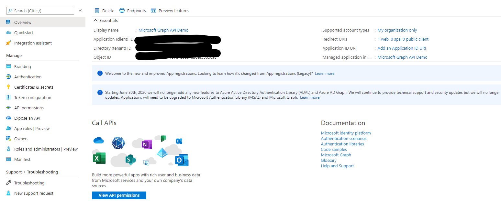
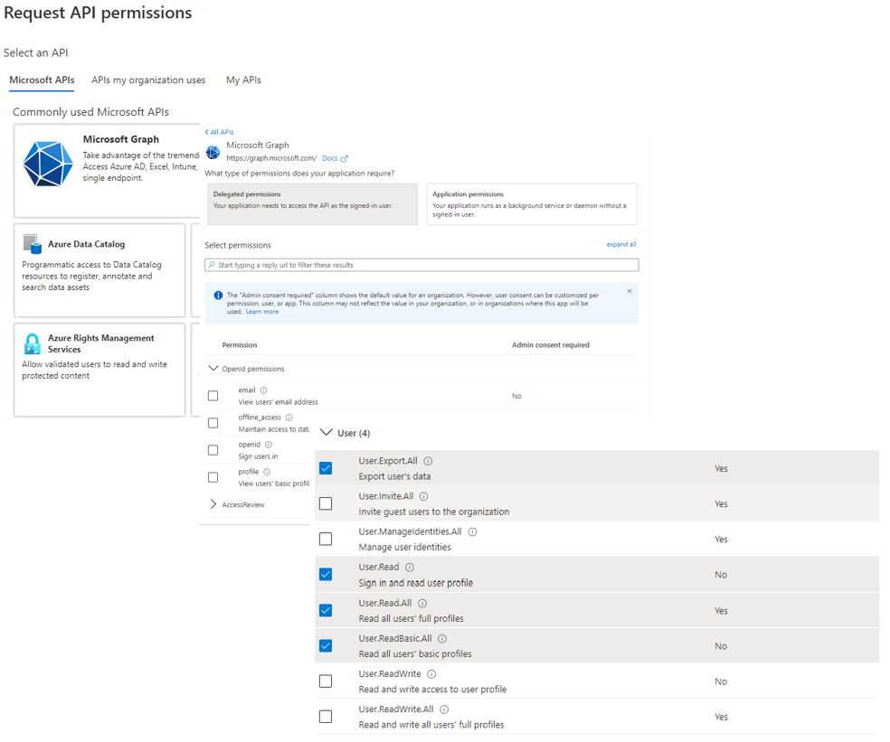
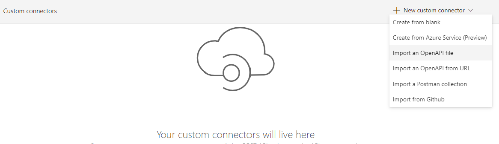
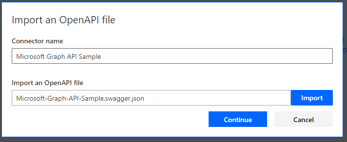
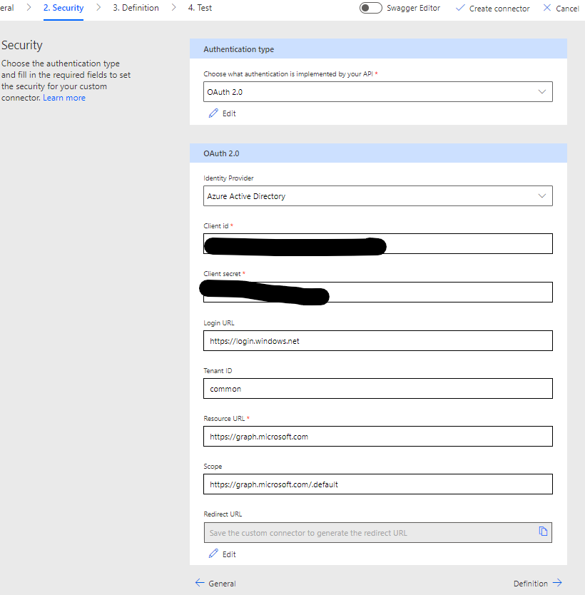
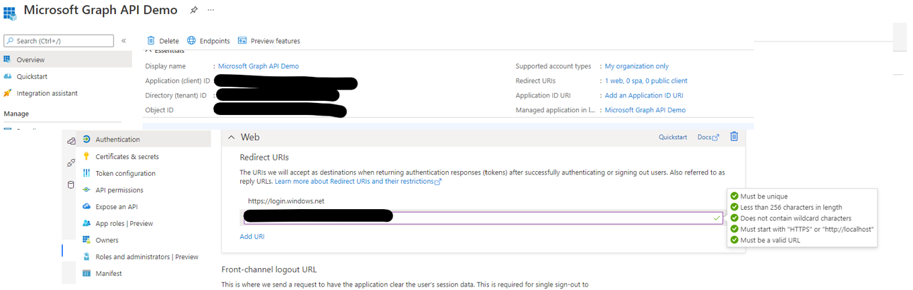

# Configure Azure Application and Import Custom Connector

## Summary

As we are using the Graph API, you need to allow your Power Automate to access it. This is done in Azure Active Directory and you need the appropriate rights on your tenant to do this. It is an administrative function, so check with your Azure Administrator.

## Applies to

*   [Microsoft Power Automate](https://docs.microsoft.com/power-automate/)

## Compatibility

## Authors

| Solution | Author(s) |
| --- | --- |
| graph_api_in_power_bi | [Scott McKenzie](https://github.com/skmckenFVSD) ([@365EDUBI](https://twitter.com/365EDUBI) )

## Version history

| Version | Date | Comments |
| --- | --- | --- |
| 1.0 | June 20th, 2021 | Initial release |

## Features

This sample demonstrates the following concepts:

*   App Registration within Azure Active Directory
*   Custom Connector for Microsoft Graph API
*   Get Organization Users within Graph API

## Minimal Path to Awesome
* [Download](customconnector/Microsoft-Graph-API-Sample.swagger.json) the `Microsoft-Graph-API-Sample.swagger.json` from the `customconnector` folder
* [Import](https://docs.microsoft.com/en-us/connectors/custom-connectors/define-openapi-definition) the `Microsoft-Graph-API-Sample.swagger.json` using **Data** > **Custom connectors** > **Import an OpenAPI file** within Power Automate.

### Configure Azure Application

As we are using the Graph API, you need to allow your Power Automate to access it. This is done in Azure Active Directory and you need the appropriate rights on your tenant to do this. It is an administrative function, so check with your Azure Administrator.

1.  Connect to [https://aad.portal.azure.com/](https://aad.portal.azure.com/) and sign in with an appropriate administrator account.
1.  Select the **App registrations** blade.
1.  Select **New Registration**. Set the fields for the App: - 
    *   **Name** This can be set to your requirements
    *   **Supported Account Type** Accounts in this organizational directory
    *   **Redirect URI: Web** https://login.windows.net 
1. Press **Register**.
1. You should now be shown the App Registration Successful Page where we can set the rest of the values and permissions we will require. Take note of the **Application (client) ID** value, in the screenshot below as this will be needed within Power Automate when creating the Custom Connector. 

    

1.  Select **Certificates & secrets** from the menu on left then **New client secret**
1.  Enter a **Description** and **Expires** option then select **Add**.
1.  Once saved, ensure you copy the value in the **Value** field, marked in purple in the screenshot below. It will only remain available while this screen is active, so *don't miss it*.

    

1.  Next, select **View API Permissions** from the menu on left, then **Add a permission**.
1.  Press **Microsoft Graph** at the top of the page then, press **Delegated Permissions** at the top of the page. 
1.  Scroll to the very bottom of the list and expand **User**. Select the following permissions:   

    | API | Permission Name | Type |
    |---|---|---
    |Microsoft Graph | User. Export.All | Delegated
    |Microsoft Graph | User.Read | Delegated
    |Microsoft Graph | User.Read.All | Delegated
    |Microsoft Graph | User.ReadBasic.All | Delegated

1.  The permissions should match the screenshot below:

    

1. Select the **Grant admin consent** button
1. Leave the App Registration Details page open as, you will need the **Redirect URL** for the Custom Connector.
### Import and configure Custom Connector

1.  [Download](/customconnector/Microsoft-Graph-API-Sample.swagger.json) the `Microsoft-Graph-API-Sample.swagger.json` file from the `customconnector` folder.
1.  Use the `Microsoft-Graph-API-Sample.swagger.json` file to create a new custom connector. Open  [https://make.powerapps.com/](https://make.powerapps.com/). Select **Data**, **Custom connectors**, **New Custom Connector**, **Import an OpenAPI file**.
  
    

1.   Select the file using the **Import** button and give the connector a name.

    

1.   Once imported, go to the **Security** tab. 
1.   Set the Security fields for the new Connector: -  
*   **Authentication Type** OAuth 2.0
*   **Identity provider** Azure Active Directory
*   **Client ID** Copied from registered application
*   **Client Secret** Copied from registered application
*   **Login URL** leave default
*   **Tenant ID** leave default
*   **Resource URL** https://graph.microsoft.com
*   **Scope** https://graph.microsoft.com/.default

    

1.   Select **Create connector**.
1.   Copy the **Redirect URL**.
1.   Return to App Registration Page in Azure, press  **Redirect URls** link located at the top of the screen. Press **Add URI** under the Web Container and paste in the Redirect URL from the Custom Connector. Press **Save** at the top of the page.

1.   Test connector by navigating to the **Test** tab. 
1   First, create a connection by selecting **New connection** and  by ensuring the **Me** operation is selected and select **Test** operation. This should give you a `200` response and details about who you are logged in as.

### Import Solution

## Disclaimer

**THIS CODE IS PROVIDED** _**AS IS**_ **WITHOUT WARRANTY OF ANY KIND, EITHER EXPRESS OR IMPLIED, INCLUDING ANY IMPLIED WARRANTIES OF FITNESS FOR A PARTICULAR PURPOSE, MERCHANTABILITY, OR NON-INFRINGEMENT.**

## Help

We do not support samples, but we this community is always willing to help, and we want to improve these samples. We use GitHub to track issues, which makes it easy for  community members to volunteer their time and help resolve issues.

If you encounter any issues while using this sample, [create a new issue](https://github.com/pnp/powerautomate-samples/issues/new?assignees=&labels=Needs%3A+Triage+%3Amag%3A%2Ctype%3Abug-suspected&template=bug-report.yml&sample=site-design-homepage&authors=@skmckenFVSD&title=site-design-homepage%20-%20).

For questions regarding this sample, [create a new question](https://github.com/pnp/powerautomate-samples/issues/new?assignees=&labels=Needs%3A+Triage+%3Amag%3A%2Ctype%3Abug-suspected&template=question.yml&sample=site-design-homepage&authors=@skmckenFVSD&title=site-design-homepage%20-%20).

Finally, if you have an idea for improvement, [make a suggestion](https://github.com/pnp/powerautomate-samples/issues/new?assignees=&labels=Needs%3A+Triage+%3Amag%3A%2Ctype%3Abug-suspected&template=suggestion.yml&sample=site-design-homepage&authors=@skmckenFVSD&title=site-design-homepage%20-%20).

## For more information

- [Create your first flow](https://docs.microsoft.com/en-us/power-automate/getting-started#create-your-first-flow)
- [Microsoft Power Automate documentation](https://docs.microsoft.com/en-us/power-automate/)

