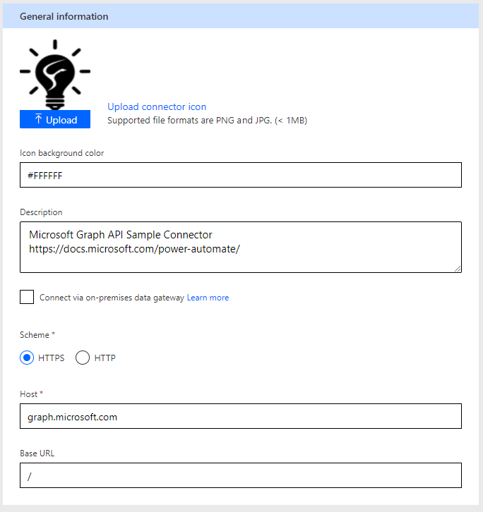

# Configure Azure Application and Import Custom Connector

## Summary

As we are using the Graph API, you need to allow your Power Automate to access it. This is done in Azure Active Directory and you need the appropriate rights on your tenant to do this. It is an administrative function, so check with your Azure Administrator.

## Applies to

*   [Microsoft Power Automate](https://docs.microsoft.com/power-automate/)

## Compatibility

## Authors

| Solution | Author(s) |
| --- | --- |
| graph_api_in_power_bi | [Scott McKenzie](https://github.com/skmckenFVSD) ([@365EDUBI](https://twitter.com/365EDUBI) )

## Version history

| Version | Date | Comments |
| --- | --- | --- |
| 1.0 | June 20th, 2021 | Initial release |

## Features

This sample demonstrates the following concepts:

*   App Registration within Azure Active Directory
*   Custom Connector for Microsoft Graph API
*   Get Organization Users within Graph API

## Minimal Path to Awesome
* [Download](customconnector/Microsoft-Graph-API-Sample.swagger.json) the `Microsoft-Graph-API-Sample.swagger.json` from the `customconnector` folder
* [Import](https://docs.microsoft.com/en-us/connectors/custom-connectors/define-openapi-definition) the `Microsoft-Graph-API-Sample.swagger.json` using **Data** > **Custom connectors** > **Import an OpenAPI file** within Power Automate.

### Configure Azure Application

As we are using the Graph API, you need to allow your Power Automate to access it. This is done in Azure Active Directory and you need the appropriate rights on your tenant to do this. It is an administrative function, so check with your Azure Administrator.

1.  Connect to [https://aad.portal.azure.com/](https://aad.portal.azure.com/) and sign in with an appropriate administrator account.
2.  Select **Azure Active Directory/App Registrations**
3.  Select **New Registration**, enter a **Name** and press **Register**.
4.  Take note of the **Application (client) ID** value, marked in yellow in the screenshot below

    

5.  Select **Certificates & secrets** then **New client secret**
6.  Enter a **Description** and **Expires** option then select **Add**.
7.  Once saved, ensure you copy the value in the **Value** field, marked in purple in the screenshot below. It will only remain available while this screen is active, so *don't miss it*.

    

8.  Next, select **API Permissions** from the menu on left, then **Add a permission**
9.  Here, ensure you give your application 3 delegated permissions, as listed below  
    | API | Permission Name | Type |
    |---|---|---
    |Microsoft Graph | Directory.ReadWrite.All | Delegated
    |Microsoft Graph | User.Invite.All | Delegated
    |Microsoft Graph | User.ReadWrite.All | Delegated
10. The permissions should match the screenshot below:

    

11. Select the **Grant admin consent** button

### Import and configure Custom Connector

The custom connector is defined in the `.json` file in the **customconnector** folder

1.  [Download](https://github.com/pnp/powerautomate-samples/blob/main/samples/teams-invites-via-graph-api/customconnector/GraphAPI.swagger.json) the `.json` file from the `customconnector` folder.
1.  Use the `.json` file to create a new custom connector. Open  [https://make.powerapps.com/](https://make.powerapps.com/). Select **Data**, **Custom connectors**, **New Custom Connector**, **Import an OpenAPI file**.
  
    

1.   Select the file using the **Import** button and give the connector a name
1.   Once imported, go to the **Security** tab. In the tab, enter the **Client id** (from instruction 4) and **Client secret** (from instruction 7) in the boxes.
1.   The **Resource URL** is populated with `https://graph.microsoft.com`
1.   Select **Create connector**.
1.   Make note of the **Redirect URL**.
1.   Back in the **Azure Application** portal, on the **Overview** pane, select the hyperlink below **Redirect URI** and **Add a Platform**.
2.   Select **Web** and enter the value from instruction 18 in the box. Select **Configure**.
2.   Once done, you can test your connector by navigating to the **Test** tab. First, create a connection by selecting **New connection** and  by ensuring the **Me** operation is selected and select **Test** operation. This should give you a `200` response and details about who you are logged in as.

### Import Solution

1.   Download the solution found under the `solution` folder
1.   Import the Flow Solution. Open  [https://flow.microsoft.com/](https://flow.microsoft.com/). Open **My Flows**, **Import**.
1.   Browse to the file you downloaded and select **Upload**. You will be presented with the screen below.
 

1.   Select the **Action** icon corresponding to **Approve Guest user access to team**, change the **Setup** to **Create as new**.
1.   For the **Connector**, select the action icon and choose the connector you have just imported.
1.   For the others, establish new or use existing for each of the connections
1.   Once complete, select **Import**.

## Disclaimer

**THIS CODE IS PROVIDED** _**AS IS**_ **WITHOUT WARRANTY OF ANY KIND, EITHER EXPRESS OR IMPLIED, INCLUDING ANY IMPLIED WARRANTIES OF FITNESS FOR A PARTICULAR PURPOSE, MERCHANTABILITY, OR NON-INFRINGEMENT.**

## Help

We do not support samples, but we this community is always willing to help, and we want to improve these samples. We use GitHub to track issues, which makes it easy for  community members to volunteer their time and help resolve issues.

If you encounter any issues while using this sample, [create a new issue](https://github.com/pnp/powerautomate-samples/issues/new?assignees=&labels=Needs%3A+Triage+%3Amag%3A%2Ctype%3Abug-suspected&template=bug-report.yml&sample=YOURSAMPLENAME&authors=@LinkeD365&title=YOURSAMPLENAME%20-%20).

For questions regarding this sample, [create a new question](https://github.com/pnp/powerautomate-samples/issues/new?assignees=&labels=Needs%3A+Triage+%3Amag%3A%2Ctype%3Abug-suspected&template=question.yml&sample=YOURSAMPLENAME&authors=@LinkeD365&title=YOURSAMPLENAME%20-%20).

Finally, if you have an idea for improvement, [make a suggestion](https://github.com/pnp/powerautomate-samples/issues/new?assignees=&labels=Needs%3A+Triage+%3Amag%3A%2Ctype%3Abug-suspected&template=suggestion.yml&sample=YOURSAMPLENAME&authors=@LinkeD365&title=YOURSAMPLENAME%20-%20).

## For more information

- [Companion blog post about this sample](https://techcommunity.microsoft.com/t5/microsoft-365-pnp-blog/using-power-automate-and-graph-api-to-manage-external-access-to/ba-p/2330775?WT.mc_id=m365-24198-cxa)
- [Create your first flow](https://docs.microsoft.com/en-us/power-automate/getting-started#create-your-first-flow)
- [Microsoft Power Automate documentation](https://docs.microsoft.com/en-us/power-automate/)

