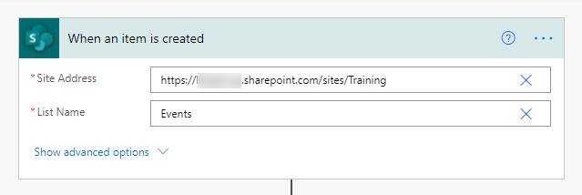
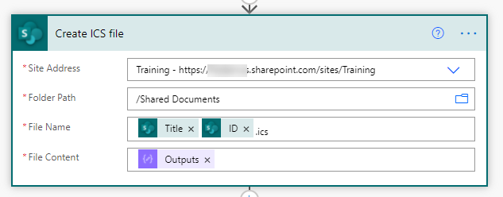
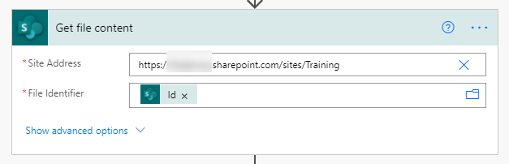

# Send an .ICS Calendar Invite

## Summary

This sample sends an `.ics` calendar invite when a new event is added to a SharePoint list

## Applies to

*   [Microsoft Power Automate](https://docs.microsoft.com/power-automate/)

## Compatibility

## Authors

| Solution | Author(s) |
| --- | --- |
| ics-calendar-invite | [April Dunnam](https://github.com/aprildunnam) ([@aprildunnam](https://www.twitter.com/aprildunnam) )

## Version history

| Version | Date | Comments |
| --- | --- | --- |
| 1.0 | May 5, 2021 | Initial release |

## Features

This sample demonstrates the following concepts:

*   Reading the content of a SharePoint list
*   Converting dates
*   Creating a `VCAL` and saving as an `.ics`
*   Attaching an `.ics` to an email

## Minimal Path to Awesome

### Create SharePoint List

Before you can use this sample flow, you'll need to create a SharePoint list containing events.

In SharePoint, create a list which contains the following columns:

| Name | Type |Required
|---|---|---|
|Title|Single line of text|Yes
|Description|Multiple lines of text|Yes
|EventDate|Date and time|Yes
|EventEnd|Date and time|Yes
|Location|Single line of text|Yes

### Import Solution

1.   Download the solution found under the `solution` folder
1.   Import the Flow Solution. Open  [https://flow.microsoft.com/](https://flow.microsoft.com/). Open **My Flows**, **Import**.
1.   Browse to the file you downloaded and select **Upload**.
1.   In the **Import package** screen, select the **SharePoint Event List**, under **Related Resources** and use the **Select during import** to select an existing connection or create a new SharePoint connection.
     
1.   For the **Outlook Connection**, under **Related Resources** and use the **Select during import** to select an existing connection or create a new Office 365 Outlook Connection.
1.   Once complete, select **Import**.

### Configure Flow

1. Once the solution is imported, edit it
1. Select the **When an item is created** trigger and replace the **Site Address** and the **List Name** to point to your SharePoint site and list name.
   
1. Select the **Create ICS File** action and replace the **Site Address** to point to your SharePoint site. Verify that the **Filter Path** points to a valid folder path on your site.
   
1. Select the **Get file content** action and replace the **Site Address** to point to your SharePoint site. 
   
1. Save your flow and add a new event to your **Events** list to test

## Disclaimer

**THIS CODE IS PROVIDED** _**AS IS**_ **WITHOUT WARRANTY OF ANY KIND, EITHER EXPRESS OR IMPLIED, INCLUDING ANY IMPLIED WARRANTIES OF FITNESS FOR A PARTICULAR PURPOSE, MERCHANTABILITY, OR NON-INFRINGEMENT.**

## Support

While we don't support samples, if you encounter any issues while using this sample, you can [create a new issue](https://github.com/pnp/powerautomate-samples/issues/new?assignees=&labels=Needs%3A+Triage+%3Amag%3A%2Ctype%3Abug-suspected&template=bug-report.yml&sample=YOURSAMPLENAME&authors=@LinkeD365&title=YOURSAMPLENAME%20-%20).

For questions regarding this sample, [create a new question](https://github.com/pnp/powerautomate-samples/issues/new?assignees=&labels=Needs%3A+Triage+%3Amag%3A%2Ctype%3Abug-suspected&template=question.yml&sample=YOURSAMPLENAME&authors=@LinkeD365&title=YOURSAMPLENAME%20-%20).

Finally, if you have an idea for improvement, [make a suggestion](https://github.com/pnp/powerautomate-samples/issues/new?assignees=&labels=Needs%3A+Triage+%3Amag%3A%2Ctype%3Abug-suspected&template=suggestion.yml&sample=YOURSAMPLENAME&authors=@LinkeD365&title=YOURSAMPLENAME%20-%20).

## For more information

- [Create your first flow](https://docs.microsoft.com/en-us/power-automate/getting-started#create-your-first-flow)
- [Microsoft Power Automate documentation](https://docs.microsoft.com/en-us/power-automate/)

