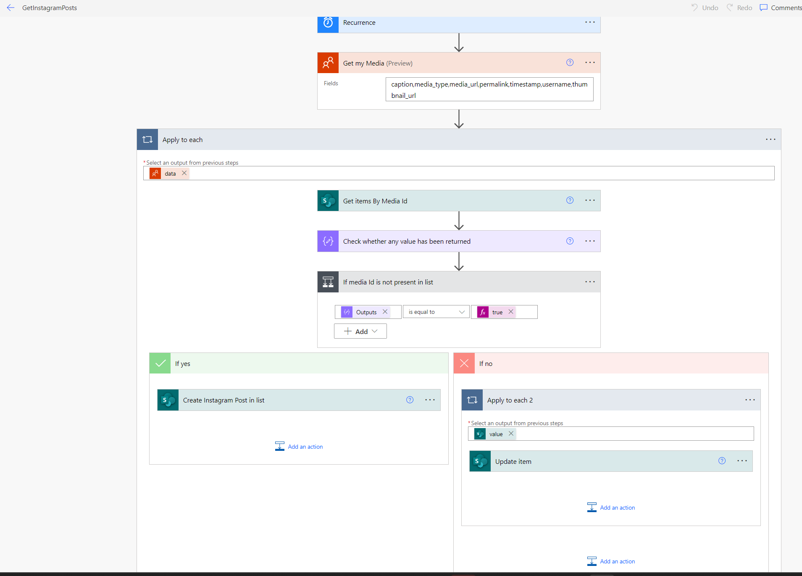

# Get Instagram media details into a SharePoint List

## Summary

Runs every hour to get media posts from Instagram using **Instagram Basic Display (IndependentPublisher)** connector.

## Applies to

* [Microsoft Power Automate](https://docs.microsoft.com/power-automate/)

## Compatibility

## Authors

| Solution               | Author(s)                                                                                               |
| ------------------------ | --------------------------------------------------------------------------------------------------------- |
| InstagramFeed | [Reshmee Auckloo](https://github.com/reshmee011)  |

## Version history

| Version | Date            | Comments                   |
| --------- | ----------------- | ---------------------------- |
| 1.0     | April 29, 2023 | Initial release            |

## Features

This sample demonstrates the uses of the **Instagram Basic Display (IndependentPublisher)** connector to populate a SharePoint list. It is a scheduled workflow running every hour and the frequency it runs can be updated.

## Prerequisites

### SharePoint List

Create a list with the following details

| Column | Type            |
| --------- | ----------------- |
| caption     | Multiple lines of text  |
| 1.0     | January 4, 2021 |
| permalink    | Single line of text    |
| timestamp    | Single line of text    |
| username    | Single line of text    |
| mediaUrl    | Multiple lines of text    |
| thumbnailUrl    | Multiple lines of text    |
| mediaId    | Single line of text    |
| mediaType    | Single line of text    |

### Access Token to use the Instagram Basic Display (IndependentPublisher) connector

This flow needs an Instagram user token. An Instagram developer account is required to generate an access token, and using that token to fetch the feed data from [Instagram's Basic Display API](https://developers.facebook.com/docs/instagram-basic-display-api/overview#instagram-user-access-tokens) environment.

Follow the steps to generate your user access token.

Step 1
Go to developers.facebook.com and sign in to your Facebook account. Click on the "My Apps" button on the top right.

Step 2 
Click on the "Create App" button.

Step 3
Select either "Consumer" or "None" as your application type.

Step 4
Give your application a name, enter your contact email, and create your app.

Step 5
Re-enter your Facebook account password

Step 6
Click on the "Set Up" button in the "Instagram Basic Display" box.

Step 7
Click on "Create New App" and click on "Create App" from the pop up to create a new instagram app id.

Step 8
Save your changes. In the "User Token Generator" section, click on the "Add or Remove Instagram Testers" button, and follow the instructions.

Step 9
Click on the link "apps and websites" link to manage instagram tester invitations and click on accept.

Step 11
Click on "Basic Display", click on "Generate Token" under "User Token Generator" and from the pop up click on "continue as <testername>".

Step 12
Click on "Allow" from the pop up to authorise the app to retrieve profile and media information about the instagram user.

Step 13
Copy the user token to be used on the webpart.

You must then enter this user token in the **Instagram Basic Display (IndependentPublisher)**   to display the instagram feeds from the user.

## Minimal Path to Awesome

* [Download](./solution/InstagramFeed.zip) the `.zip` from the `solution` folder
* Browse to [Power Automate](https://flow.microsoft.com/manage/environments) and select the environment where you wish to import the sample
* From the toolbar, select **Import**
* In the **Import package** page, select **Upload** and choose the `.zip` file containing the sample flow.
* Select **Import**
* Create the connections for InstagramBasicDisplay (enter the access token) and SharePoint InstagramFeed-fed15 [Connections](./assets/ImportSolution_connectionReference_3.png) 
* Update list and Site Url environment variables [Site Url](./assets/ImportSolution_SiteUrl_10.png) and [list](./assets/ImportSolution_list_11.png)

## Help

We do not support samples, but we this community is always willing to help, and we want to improve these samples. We use GitHub to track issues, which makes it easy for  community members to volunteer their time and help resolve issues.

If you encounter any issues while using this sample, [create a new issue](https://github.com/pnp/powerautomate-samples/issues/new?assignees=&labels=Needs%3A+Triage+%3Amag%3A%2Ctype%3Abug-suspected&template=bug-report.yml&sample=YOURSAMPLENAME&authors=@YOURGITHUBUSERNAME&title=YOURSAMPLENAME%20-%20).

For questions regarding this sample, [create a new question](https://github.com/pnp/powerautomate-samples/issues/new?assignees=&labels=Needs%3A+Triage+%3Amag%3A%2Ctype%3Abug-suspected&template=question.yml&sample=YOURSAMPLENAME&authors=@YOURGITHUBUSERNAME&title=YOURSAMPLENAME%20-%20).

Finally, if you have an idea for improvement, [make a suggestion](https://github.com/pnp/powerautomate-samples/issues/new?assignees=&labels=Needs%3A+Triage+%3Amag%3A%2Ctype%3Abug-suspected&template=suggestion.yml&sample=YOURSAMPLENAME&authors=@YOURGITHUBUSERNAME&title=YOURSAMPLENAME%20-%20).

## For more information

* [Create your first flow](https://docs.microsoft.com/en-us/power-automate/getting-started#create-your-first-flow)
* [Microsoft Power Automate documentation](https://docs.microsoft.com/en-us/power-automate/)

