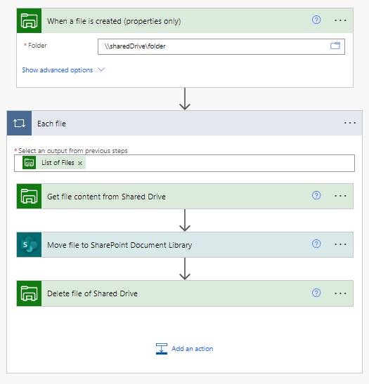

# Move files to SharePoint document library from Shared Drive using Power Automate

## Summary

This is sample demonstrates how to move recently created files from Shared drive to SharePoint document library.

## Applies to

* [Microsoft Power Automate](https://docs.microsoft.com/power-automate/)

## Compatibility

> Don't worry about this section, we'll take care of it. Unless you really want to...

## Authors

Solution|Author(s)
--------|---------
move-files-to-sharepoint-from-shared-drive | [Dinesh Girase](https://github.com/dgirase) ([@dinugirase](https://twitter.com/dinugirase))

## Version history

Version|Date|Comments
-------|----|--------
1.0|October 25, 2025|Initial release

## Features

This sample demonstrates the following concepts:

* Triggerd the power automate when file gets created on shared drive (physical location)
* Get the file content using file Id.
* Create a actual file in SharePoint document library.
* Delete the file from Shared Drive (physical location).

## Prerequisites

[Download and Install](https://learn.microsoft.com/en-us/data-integration/gateway/service-gateway-install) on-premises data gateway on Virtual Machine where the shared drive is accessible. The on-premises data gateway acts as a bridge. It provides quick and secure data transfer between on-premises data, which is data that isn't in the cloud, and several Microsoft cloud services.

## Minimal Path to Awesome

* [Download](solution/movefiletosharepointfromshareddrive.zip) the `.zip` from the `solution` folder
* [Install](https://learn.microsoft.com/en-us/data-integration/gateway/service-gateway-install) the on-premises data gateway.
* Browse to [Power Automate Portal](https://make.powerautomate.com) and select the environment you want to import the sample to
* [Import](https://flow.microsoft.com/en-us/blog/import-export-bap-packages/) the `.zip` file using **My Flows** > **Import** > **Upload** within Microsoft Flow.
* Change and configure the connection for file system.

## Disclaimer

**THIS CODE IS PROVIDED *AS IS* WITHOUT WARRANTY OF ANY KIND, EITHER EXPRESS OR IMPLIED, INCLUDING ANY IMPLIED WARRANTIES OF FITNESS FOR A PARTICULAR PURPOSE, MERCHANTABILITY, OR NON-INFRINGEMENT.**

## Help

> Note: don't worry about this section, we'll update the links.

We do not support samples, but we this community is always willing to help, and we want to improve these samples. We use GitHub to track issues, which makes it easy for  community members to volunteer their time and help resolve issues.

If you encounter any issues while using this sample, [create a new issue](https://github.com/pnp/powerautomate-samples/issues/new?assignees=&labels=Needs%3A+Triage+%3Amag%3A%2Ctype%3Abug-suspected&template=bug-report.yml&sample=YOURSAMPLENAME&authors=@YOURGITHUBUSERNAME&title=YOURSAMPLENAME%20-%20).

For questions regarding this sample, [create a new question](https://github.com/pnp/powerautomate-samples/issues/new?assignees=&labels=Needs%3A+Triage+%3Amag%3A%2Ctype%3Abug-suspected&template=question.yml&sample=YOURSAMPLENAME&authors=@YOURGITHUBUSERNAME&title=YOURSAMPLENAME%20-%20).

Finally, if you have an idea for improvement, [make a suggestion](https://github.com/pnp/powerautomate-samples/issues/new?assignees=&labels=Needs%3A+Triage+%3Amag%3A%2Ctype%3Abug-suspected&template=suggestion.yml&sample=YOURSAMPLENAME&authors=@YOURGITHUBUSERNAME&title=YOURSAMPLENAME%20-%20).

## For more information

- [Create your first flow](https://docs.microsoft.com/en-us/power-automate/getting-started#create-your-first-flow)
- [Microsoft Power Automate documentation](https://docs.microsoft.com/en-us/power-automate/)

---
