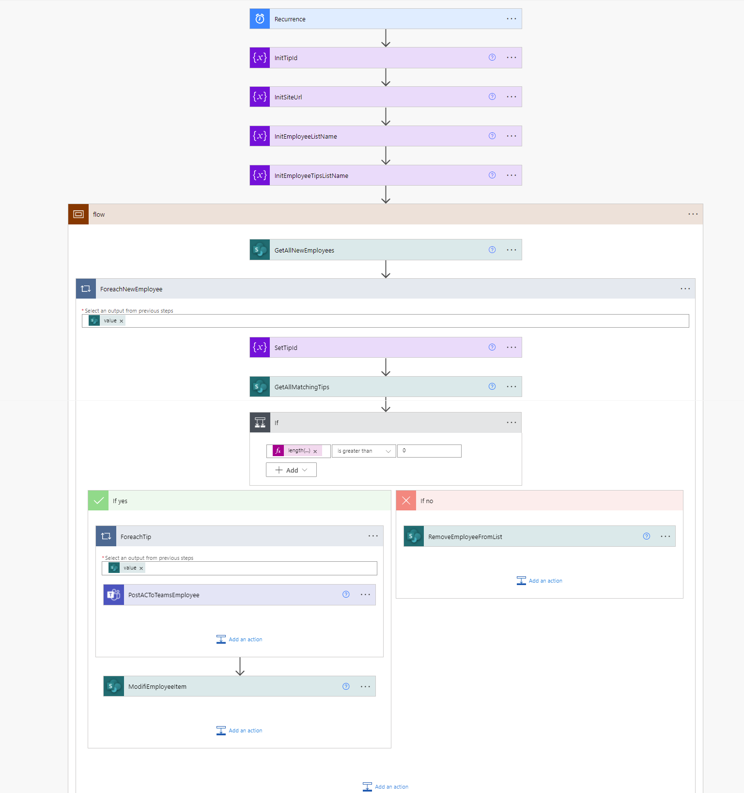
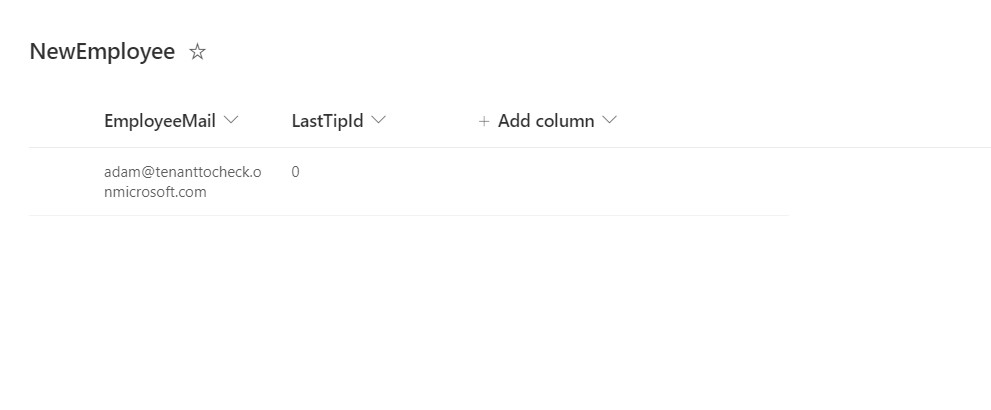
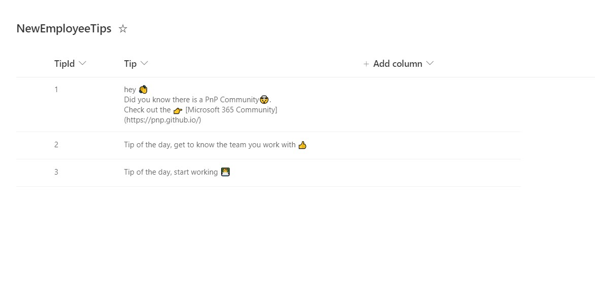
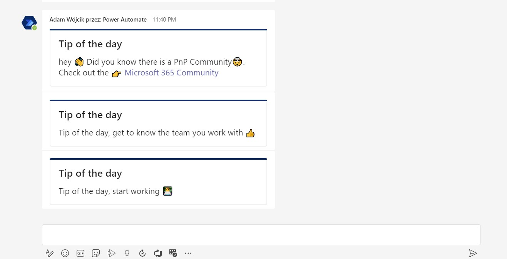
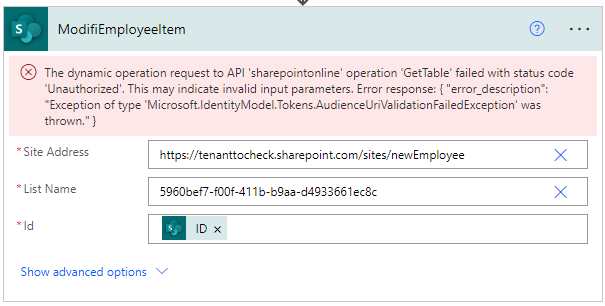
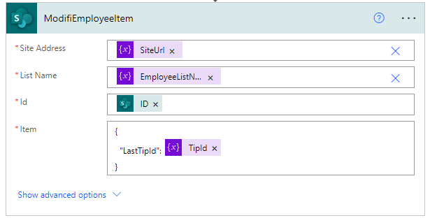
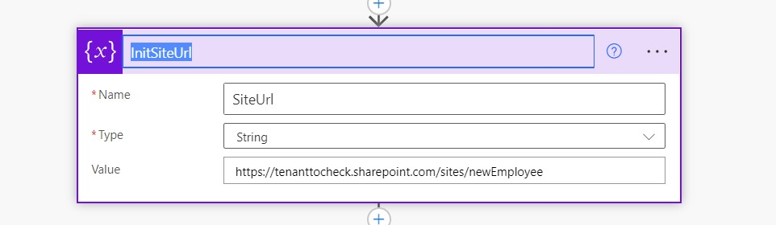

# Pattern: new-employee-tip-of-the-day

## Summary

The flow was created to fulfill real case scenario to improve new employee introduction process. Every new employee at the beginning may be overwhelmed with the amount of knowledge they need to learn. The flow is supposed to run every day (once a day). Retrieves employees added from newEmployee list (gets the emails). 

If there is any newEmployee item the flow gets a tip to be sent to the user with helpful information.

and sends it to the user's personal chat in MS Teams as an adaptive card.

When all tips are sent to the user, the next day the flow removes the  employee item from the list (clean up).

## Applies to

* [Microsoft Power Automate](https://docs.microsoft.com/power-automate)

## Compatibility

## Authors

Solution|Author(s)
--------|---------
new-employee-tip-of-the-day | [Adam Wójcik](https://github.com/Adam-it)
new-employee-tip-of-the-day | [Ramin Ahmadi](https://github.com/ahmadiramin)

## Version history

Version|Date|Comments
-------|----|--------
1.0|October 07, 2021|Initial release
1.1|July 14,2022|Fix update employee list action

## Features

This sample demonstrates the following concepts:

* Retreive items from SharePoint List
* Apply adaptive card using flow to Teams user chat

# Bug fixes

ModifiEmployeeItem was using hard coded URL and list name, also it was updating the item in a wrong way:

It's now using the variables and a better way of updating the item:

## Minimal Path to Awesome

* [Download](solution/NewEmployeeTips.zip) the `.zip` from the `solution` folder
* [Import](https://flow.microsoft.com/en-us/blog/import-export-bap-packages/) the `.zip` file using **My Flows** > **Import** > **Upload** within Microsoft Flow.
* Create the newEmployee list and newEmployeeTips list using the xml templates and [PnP PowerShell](https://docs.microsoft.com/en-us/powershell/sharepoint/sharepoint-pnp/sharepoint-pnp-cmdlets) using command [Invoke-PnPSiteTemplate](https://docs.microsoft.com/en-us/powershell/module/sharepoint-pnp/invoke-pnpsitetemplate?view=sharepoint-ps)
* modify the beginning of the flow (step InitSiteUrl) and add the url of your site were newEmployee list and newEmployeeTips list was added 

## Disclaimer

**THIS CODE IS PROVIDED *AS IS* WITHOUT WARRANTY OF ANY KIND, EITHER EXPRESS OR IMPLIED, INCLUDING ANY IMPLIED WARRANTIES OF FITNESS FOR A PARTICULAR PURPOSE, MERCHANTABILITY, OR NON-INFRINGEMENT.**
