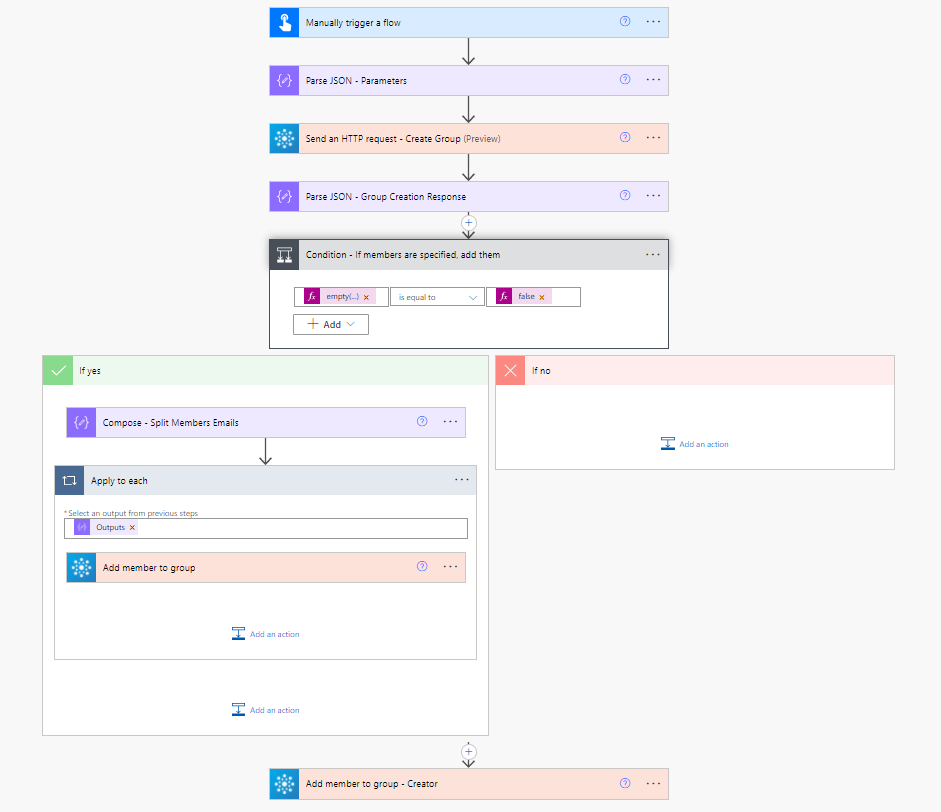
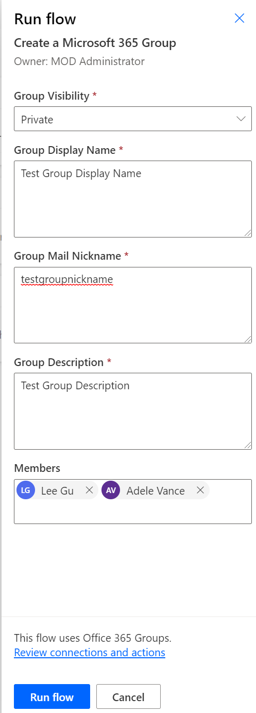
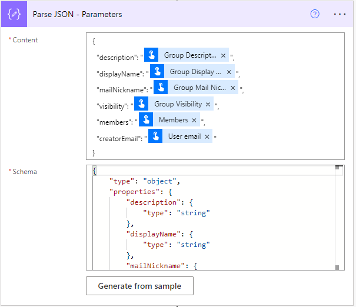

# Create Microsoft 365 Groups using the Groups Connector and Microsoft Graph

## Summary

Creates Microsoft 365 Groups using the Office 365 Groups Connector action 'Send an HTTP Request' and the Microsoft Graph Groups endpoint.
Adds members to the group if specified.

## Applies to

* [Microsoft Power Automate](https://docs.microsoft.com/power-automate/)

## Compatibility

> Don't worry about this section, we'll take care of it. Unless you really want to...

## Authors

Solution|Author(s)
--------|---------
o365groups-graph-create-group | [Michel Mendes](https://github.com/michelcarlo) ([@michelcarlo](https://twitter.com/michelcarlo))

## Version history

Version|Date|Comments
-------|----|--------
1.0|February 01, 2022|Initial release

## Features

This is a sample of how to create Microsoft 365 Groups using the Office 365 Groups Connector and the 'Send an HTTP Request' action.
As currently there is no out-of-the-box action for creating groups under the Office 365 Groups connector, Graph API can be easily used instead.

When running this flow, the following parameters are requested:

* Description
* Display Name
* Mail Nickname
* Visibility (Private/Public)
* Members (Optional - Add users here if you want to add members to the group after creating it)

This flow is built using a manual trigger, but can be tweaked to have the trigger changed to be part of a bigger automation workflow.

In case this is the goal, replace the trigger and update the source values in the first 'Parse JSON' action highlighted below when changing the trigger, all references in this flow are based on this action:

## Minimal Path to Awesome

* [Download](solution/groups-graph-create-group.zip) the `.zip` from the `solution` folder
* [Import](https://flow.microsoft.com/en-us/blog/import-export-bap-packages/) the `.zip` file using **My Flows** > **Import** > **Upload** within Microsoft Flow.
* Important to highlight that the account where the flow is going to be imported needs to have permissions to create Microsoft 365 Groups.
* If the tenant has restricted groups creation and the user does not have permissions, the flow will fail.

## Disclaimer

**THIS CODE IS PROVIDED *AS IS* WITHOUT WARRANTY OF ANY KIND, EITHER EXPRESS OR IMPLIED, INCLUDING ANY IMPLIED WARRANTIES OF FITNESS FOR A PARTICULAR PURPOSE, MERCHANTABILITY, OR NON-INFRINGEMENT.**

## Help

> Note: don't worry about this section, we'll update the links.

We do not support samples, but we this community is always willing to help, and we want to improve these samples. We use GitHub to track issues, which makes it easy for  community members to volunteer their time and help resolve issues.

If you encounter any issues while using this sample, [create a new issue](https://github.com/pnp/powerautomate-samples/issues/new?assignees=&labels=Needs%3A+Triage+%3Amag%3A%2Ctype%3Abug-suspected&template=bug-report.yml&sample=YOURSAMPLENAME&authors=@YOURGITHUBUSERNAME&title=YOURSAMPLENAME%20-%20).

For questions regarding this sample, [create a new question](https://github.com/pnp/powerautomate-samples/issues/new?assignees=&labels=Needs%3A+Triage+%3Amag%3A%2Ctype%3Abug-suspected&template=question.yml&sample=YOURSAMPLENAME&authors=@YOURGITHUBUSERNAME&title=YOURSAMPLENAME%20-%20).

Finally, if you have an idea for improvement, [make a suggestion](https://github.com/pnp/powerautomate-samples/issues/new?assignees=&labels=Needs%3A+Triage+%3Amag%3A%2Ctype%3Abug-suspected&template=suggestion.yml&sample=YOURSAMPLENAME&authors=@YOURGITHUBUSERNAME&title=YOURSAMPLENAME%20-%20).

## For more information

- [Create your first flow](https://docs.microsoft.com/en-us/power-automate/getting-started#create-your-first-flow)
- [Microsoft Power Automate documentation](https://docs.microsoft.com/en-us/power-automate/)

---
