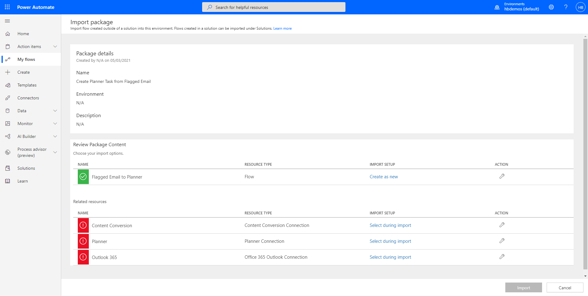
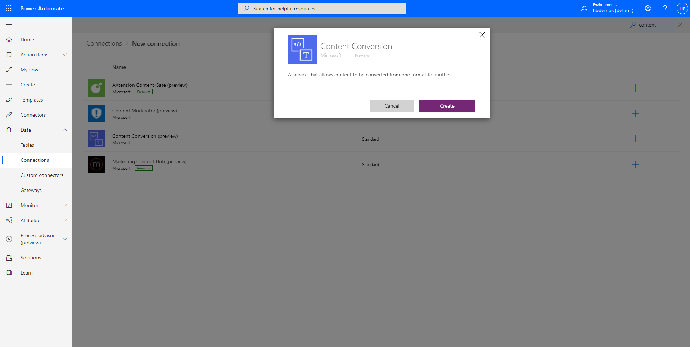
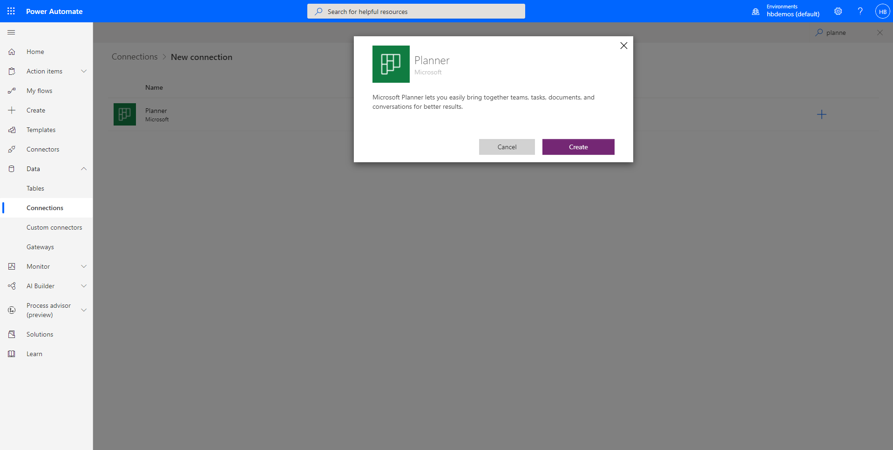
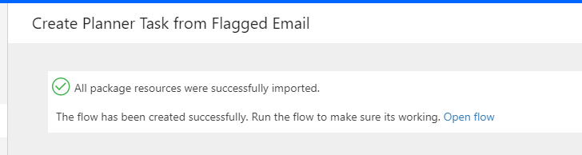
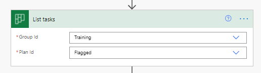
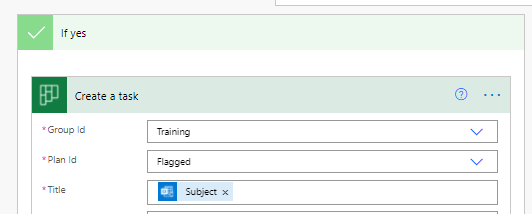

# Flagged Email to Planner

## Summary

Create Planner Task from flagged emails

## Applies to

*   [Microsoft Power Automate](https://docs.microsoft.com/power-automate/)

## Compatibility

## Authors

| Solution | Author(s) |
| --- | --- |
| planner-task-from-flagged-email | [April Dunnam](https://github.com/aprildunnam) ([@aprildunnam](https://www.twitter.com/aprildunnam) )

## Version history

| Version | Date | Comments |
| --- | --- | --- |
| 1.0 | May 5, 2021 | Initial release |

## Features

This sample demonstrates the following concepts:

*   Reading flagged emails
*   Converting HTML to text
*   Adding a planner task

## Pre-requisites

You'll need a Planner plan and an Outlook 365 inbox

## Minimal Path to Awesome

### Import Solution

1.   [Download the solution](./solution/planner-task-from-flagged-email.zip) found under the `solution` folder
1.   Import the Flow Solution. Open  [https://flow.microsoft.com/](https://flow.microsoft.com/). Open **My Flows**, **Import**.
1.   Browse to the file you downloaded and select **Upload**.
     
1.   In the **Import package** screen, select the **Content Conversion**, under **Related Resources** and use the **Select during import** to create a new **Content Conversion** connection.
     
     
1.   For **Planner**, under **Related Resources** use the **Select during import** to create a new **Planner** connection.
     
1.   For **Outlook 365**, under **Related Resources** use the **Select during import** to create a new **Office 365 Outlook Connection** connection.
1.   Once complete, select **Import**.

### Configure Flow

1. Once the solution is imported, open it by selecting **Open flow**
   
1. Select the **List tasks** action and replace the **Group Id** and the **Plan Id** to point to an existing group and plan of your choice.
   
1. Expand the **Condition** and select the **Create a task** action and replace the **Group Id** and **Plan Id** to point your group and plan of your choice.
   
1. Save your flow and flag an email to  test

## Disclaimer

**THIS CODE IS PROVIDED** _**AS IS**_ **WITHOUT WARRANTY OF ANY KIND, EITHER EXPRESS OR IMPLIED, INCLUDING ANY IMPLIED WARRANTIES OF FITNESS FOR A PARTICULAR PURPOSE, MERCHANTABILITY, OR NON-INFRINGEMENT.**

## Help

We do not support samples, but we this community is always willing to help, and we want to improve these samples. We use GitHub to track issues, which makes it easy for  community members to volunteer their time and help resolve issues.

If you encounter any issues while using this sample, [create a new issue](https://github.com/pnp/powerautomate-samples/issues/new?assignees=&labels=Needs%3A+Triage+%3Amag%3A%2Ctype%3Abug-suspected&template=bug-report.yml&sample=YOURSAMPLENAME&authors=@LinkeD365&title=YOURSAMPLENAME%20-%20).

For questions regarding this sample, [create a new question](https://github.com/pnp/powerautomate-samples/issues/new?assignees=&labels=Needs%3A+Triage+%3Amag%3A%2Ctype%3Abug-suspected&template=question.yml&sample=YOURSAMPLENAME&authors=@LinkeD365&title=YOURSAMPLENAME%20-%20).

Finally, if you have an idea for improvement, [make a suggestion](https://github.com/pnp/powerautomate-samples/issues/new?assignees=&labels=Needs%3A+Triage+%3Amag%3A%2Ctype%3Abug-suspected&template=suggestion.yml&sample=YOURSAMPLENAME&authors=@LinkeD365&title=YOURSAMPLENAME%20-%20).

## For more information

- [Create your first flow](https://docs.microsoft.com/en-us/power-automate/getting-started#create-your-first-flow)
- [Microsoft Power Automate documentation](https://docs.microsoft.com/en-us/power-automate/)

