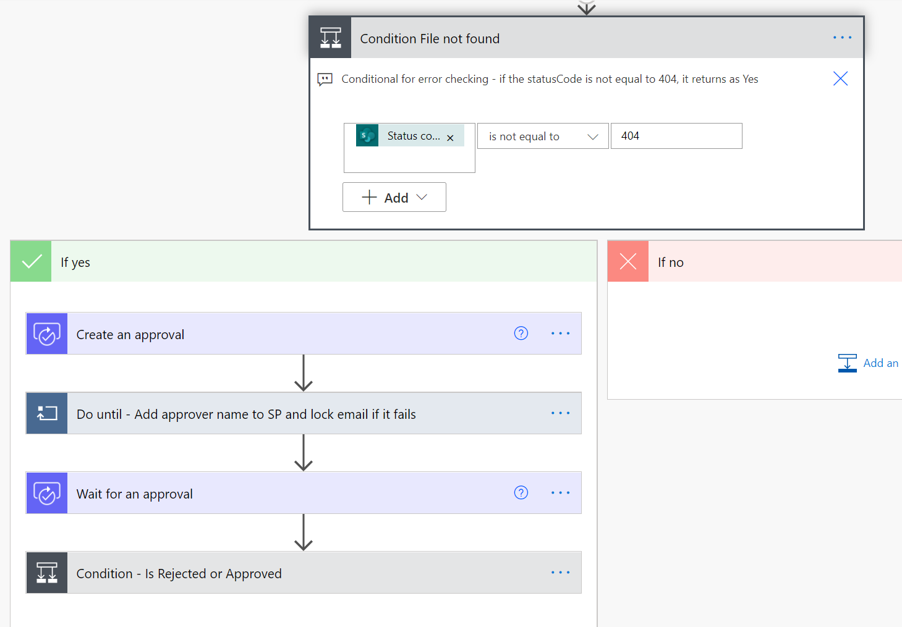

# Request Review and Approval for a Selected File

## Summary

This flow utilizes a SharePoint document library and Approvals to request that a supervisor or user review a file, approve or reject the file, and updates the SharePoint library with this information.  Common error handling is included

## Applies to

* [Microsoft Power Automate](https://docs.microsoft.com/power-automate/)

## Compatibility

## Authors

Solution|Author(s)
--------|---------
request-review-and-approval-for-a-selected-file | [Lindsay Shelton](https://github.com/lsheltonSTO) ([@lshelton_tech](https://twitter.com/lshelton_tech)), Stowers Institute for Medical Research

## Version history

Version|Date|Comments
-------|----|--------
1.0|September 14, 2021|Initial release

## Features

This sample illustrates the following concepts:

* Triggering a Power Automate flow for a selected SharePoint library item
* Using Approvals to allow for approval/rejection in Teams or via Outlook
* Updating SharePoint document library with records of the approval

## Prerequisites

A SharePoint document library with columns for a SupervisorReviewer (person or group), SupervisorReviewStatus (choice column, with Yes, No, and Pending), and SupervisorReviewComments (multi-line text)

Note that if you want to allow for more than one supervisor to be added as a reviewer, make sure to configure the SupervisorReviewer field the following way:

## Minimal Path to Awesome

* [Download](./solution/RequestReviewandApprovalforaSelectedFile.zip) the `.zip` from the `solution` folder
* Browse to [Power Automate](https://flow.microsoft.com/manage/environments) and select the environment where you wish to import the sample
* From the toolbar, select **Import**
* In the **Import package** page, select **Upload** and choose the `.zip` file containing the sample flow.
* Select **Import**
* Customize the flow with your own SharePoint library and column names
* Go to the "Update file properties" action within the "Do until - Add approver name to SP and lock email if it fails" action and if you are allowing more than one reviewer, you may need to change the "SupervisorReviewer" field to "Switch to input entire array" before you can add the "supervisorReviewers" array variable

## Disclaimer

**THIS CODE IS PROVIDED *AS IS* WITHOUT WARRANTY OF ANY KIND, EITHER EXPRESS OR IMPLIED, INCLUDING ANY IMPLIED WARRANTIES OF FITNESS FOR A PARTICULAR PURPOSE, MERCHANTABILITY, OR NON-INFRINGEMENT.**

## Help

We do not support samples, but we this community is always willing to help, and we want to improve these samples. We use GitHub to track issues, which makes it easy for  community members to volunteer their time and help resolve issues.

If you encounter any issues while using this sample, [create a new issue](https://github.com/pnp/powerautomate-samples/issues/new?assignees=&labels=Needs%3A+Triage+%3Amag%3A%2Ctype%3Abug-suspected&template=bug-report.yml&sample=YOURSAMPLENAME&authors=@YOURGITHUBUSERNAME&title=YOURSAMPLENAME%20-%20).

For questions regarding this sample, [create a new question](https://github.com/pnp/powerautomate-samples/issues/new?assignees=&labels=Needs%3A+Triage+%3Amag%3A%2Ctype%3Abug-suspected&template=question.yml&sample=YOURSAMPLENAME&authors=@YOURGITHUBUSERNAME&title=YOURSAMPLENAME%20-%20).

Finally, if you have an idea for improvement, [make a suggestion](https://github.com/pnp/powerautomate-samples/issues/new?assignees=&labels=Needs%3A+Triage+%3Amag%3A%2Ctype%3Abug-suspected&template=suggestion.yml&sample=YOURSAMPLENAME&authors=@YOURGITHUBUSERNAME&title=YOURSAMPLENAME%20-%20).

## For more information

- [Create your first flow](https://docs.microsoft.com/en-us/power-automate/getting-started#create-your-first-flow)
- [Microsoft Power Automate documentation](https://docs.microsoft.com/en-us/power-automate/)

---
