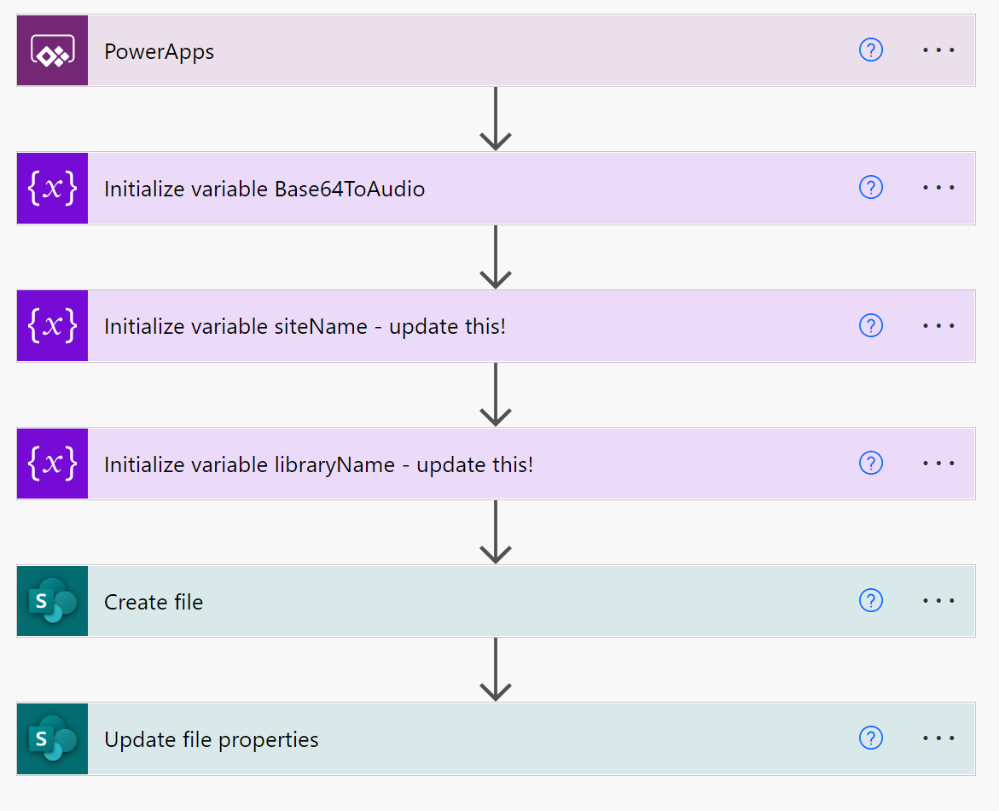
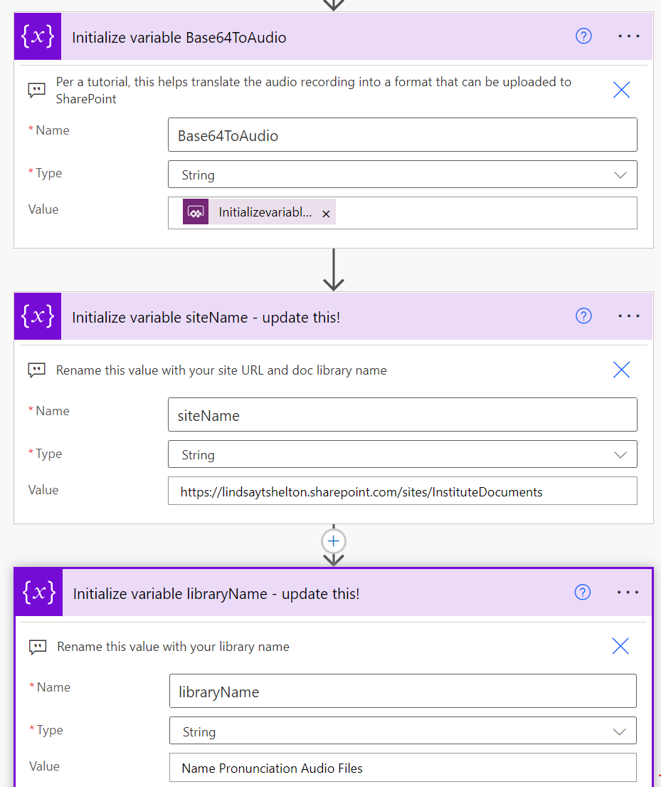
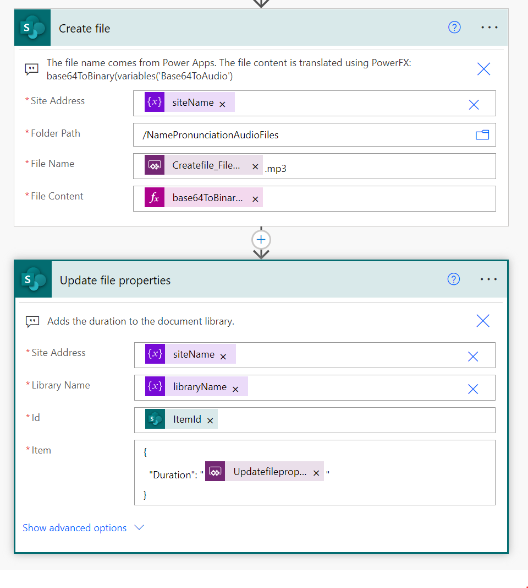

# Send Name Pronunciation Recording to Library

## Summary

We live in an incredibly diverse society, but one of the challenges that can come with that is working with people who have names from different cultures and languages that might not be immediately clear how to pronounce.  This is meant to serve as a solution to that problem.  Paired with the "Name Pronunciation Database" Power Apps sample and a document library, you can utilize this Power Automate flow to allow your users to record their name pronunciations and upload them to SharePoint, where others in your organization can then listen to them and practice on their own, leading to increasingly satisfying interactions and reducing confusion over a common problem.

One possible extension of this solution is having your users also share their pronouns as a part of their recording.  Our organization's example prompt for recordings is "My name is Jane Doe, and my pronouns are they/them".  Feel free to adapt to your organization's needs, but we felt this was more inclusive.

## Applies to

* [Microsoft Power Apps](https://docs.microsoft.com/powerapps/)
* [Microsoft Power Automate](https://docs.microsoft.com/power-automate/)
* [Microsoft SharePoint](https://learn.microsoft.com/en-us/sharepoint/)

## Compatibility

> Don't worry about this section, we'll take care of it. Unless you really want to...

## Authors

Solution|Author(s)
--------|---------
send-name-pronunciation-recording-to-library | [Lindsay Shelton](https://github.com/lsheltonSTO) ([@lshelton_tech](https://twitter.com/lshelton_tech)), Stowers Institute for Medical Research

## Version history

Version|Date|Comments
-------|----|--------
1.0|October 11, 2022|Initial release

## Features

The accompanying Power App could be modified for anything you'd like users to record using the audio functionality in Power Apps - it isn't limited to just a name pronunciation database.  Feel free to modify this Power Automate sample to use a different data source as well.

This sample illustrates the following concepts:

* Using the Audio and Microphone functionality in Power Apps
* Transforming that audio data into a format that SharePoint can read
* Uploading that transformed audio data into a SharePoint document library

## Prerequisites

Make sure to download this sample and import it BEFORE you try to import the associated Power App, "Name Pronunciation Database".  Errors may occur if you try to import the .msapp file without the Power Automate flow already in place.

## Data Sources

The data flows into the SharePoint Document Library, but that can be changed in this flow.

### SharePoint Document Library

This SharePoint Document Library contains all of the uploaded audio files.  Set the list up as follows:

|Type|Internal Name|Required|
|---|---|:---:|
|Single line of text|Name (renaming default Title column)|Yes|
|Number|Duration|No|

## Minimal Path to Awesome

* [Download](./solution/send-name-pronunciation-recording-to-library.zip) the `.zip` from the `solution` folder
* Browse to [Power Automate](https://flow.microsoft.com/manage/environments) and select the environment where you wish to import the sample
* From the toolbar, select **Import**
* In the **Import package** page, select **Upload** and choose the `.zip` file containing the sample flow.
* Select **Import**
* ...

## Using the Source

  You can also use the source and create your own `.zip` file by following these steps:

* ...

## Disclaimer

**THIS CODE IS PROVIDED *AS IS* WITHOUT WARRANTY OF ANY KIND, EITHER EXPRESS OR IMPLIED, INCLUDING ANY IMPLIED WARRANTIES OF FITNESS FOR A PARTICULAR PURPOSE, MERCHANTABILITY, OR NON-INFRINGEMENT.**

## Help

> Note: don't worry about this section, we'll update the links.

We do not support samples, but we this community is always willing to help, and we want to improve these samples. We use GitHub to track issues, which makes it easy for  community members to volunteer their time and help resolve issues.

If you encounter any issues while using this sample, [create a new issue](https://github.com/pnp/powerautomate-samples/issues/new?assignees=&labels=Needs%3A+Triage+%3Amag%3A%2Ctype%3Abug-suspected&template=bug-report.yml&sample=YOURSAMPLENAME&authors=@YOURGITHUBUSERNAME&title=YOURSAMPLENAME%20-%20).

For questions regarding this sample, [create a new question](https://github.com/pnp/powerautomate-samples/issues/new?assignees=&labels=Needs%3A+Triage+%3Amag%3A%2Ctype%3Abug-suspected&template=question.yml&sample=YOURSAMPLENAME&authors=@YOURGITHUBUSERNAME&title=YOURSAMPLENAME%20-%20).

Finally, if you have an idea for improvement, [make a suggestion](https://github.com/pnp/powerautomate-samples/issues/new?assignees=&labels=Needs%3A+Triage+%3Amag%3A%2Ctype%3Abug-suspected&template=suggestion.yml&sample=YOURSAMPLENAME&authors=@YOURGITHUBUSERNAME&title=YOURSAMPLENAME%20-%20).

## For more information

- [Create your first flow](https://docs.microsoft.com/en-us/power-automate/getting-started#create-your-first-flow)
- [Microsoft Power Automate documentation](https://docs.microsoft.com/en-us/power-automate/)

