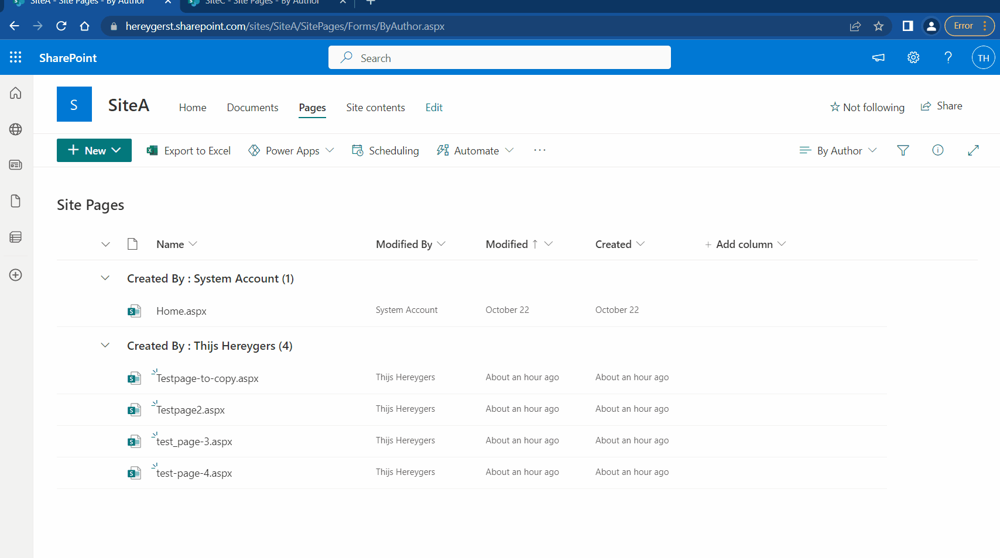

# Copy pages between sites in SharePoint

## Summary

It's not possible to copy sharepoint pages between different sites within the sharepoint browser UI, but an enduser often needs this functionality.
Without needing to know any powershell or API calls this flow allows an enduser to copy and publish their sharepoint page to a different sites.

## Applies to

* [Microsoft Power Automate](https://docs.microsoft.com/power-automate/)
* [Microsoft Sharepoint](https://docs.microsoft.com/sharepoint/)

## Compatibility

## Authors

Solution|Author(s)
--------|---------
sharepoint-copy-pages-between-sites | [Thijs Hereygers](https://github.com/ThijsHereygersPNP/) ([@Thijs9000](https://twitter.com/thijs9000)), Capgemini

## Version history

Version|Date|Comments
-------|----|--------
1.0|December 2, 2022|Initial release

## Features

This flow is aimed at endusers who have the requirement to sometimes copy pages to other sites and make it easy without the need for powershell and/or figuring out the API.

## Minimal Path to Awesome

* [Download](./solution/sharepoint-copy-pages-between-sites.zip) the `.zip` from the `solution` folder
* Browse to [Power Automate](https://flow.microsoft.com/manage/environments) and select the environment where you wish to import the sample
* From the toolbar, select **Import**
* In the **Import package** page, select **Upload** and choose the `.zip` file containing the sample flow.
* Select **Import**
* Inside the flow, connect to your sharepoint environment, adjust siteURL's and sitepageID's where necessary.

## Disclaimer

**THIS CODE IS PROVIDED *AS IS* WITHOUT WARRANTY OF ANY KIND, EITHER EXPRESS OR IMPLIED, INCLUDING ANY IMPLIED WARRANTIES OF FITNESS FOR A PARTICULAR PURPOSE, MERCHANTABILITY, OR NON-INFRINGEMENT.**

## Help

> Note: don't worry about this section, we'll update the links.

We do not support samples, but we this community is always willing to help, and we want to improve these samples. We use GitHub to track issues, which makes it easy for  community members to volunteer their time and help resolve issues.

If you encounter any issues while using this sample, [create a new issue](https://github.com/pnp/powerautomate-samples/issues/new?assignees=&labels=Needs%3A+Triage+%3Amag%3A%2Ctype%3Abug-suspected&template=bug-report.yml&sample=YOURSAMPLENAME&authors=@YOURGITHUBUSERNAME&title=YOURSAMPLENAME%20-%20).

For questions regarding this sample, [create a new question](https://github.com/pnp/powerautomate-samples/issues/new?assignees=&labels=Needs%3A+Triage+%3Amag%3A%2Ctype%3Abug-suspected&template=question.yml&sample=YOURSAMPLENAME&authors=@YOURGITHUBUSERNAME&title=YOURSAMPLENAME%20-%20).

Finally, if you have an idea for improvement, [make a suggestion](https://github.com/pnp/powerautomate-samples/issues/new?assignees=&labels=Needs%3A+Triage+%3Amag%3A%2Ctype%3Abug-suspected&template=suggestion.yml&sample=YOURSAMPLENAME&authors=@YOURGITHUBUSERNAME&title=YOURSAMPLENAME%20-%20).

## For more information

- [Create your first flow](https://docs.microsoft.com/en-us/power-automate/getting-started#create-your-first-flow)
- [Microsoft Power Automate documentation](https://docs.microsoft.com/en-us/power-automate/)

