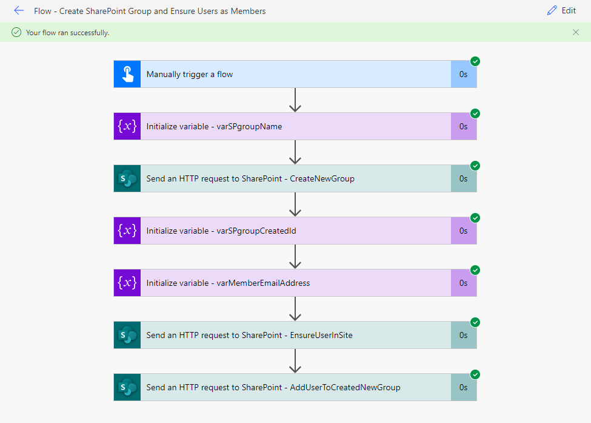
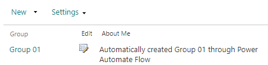
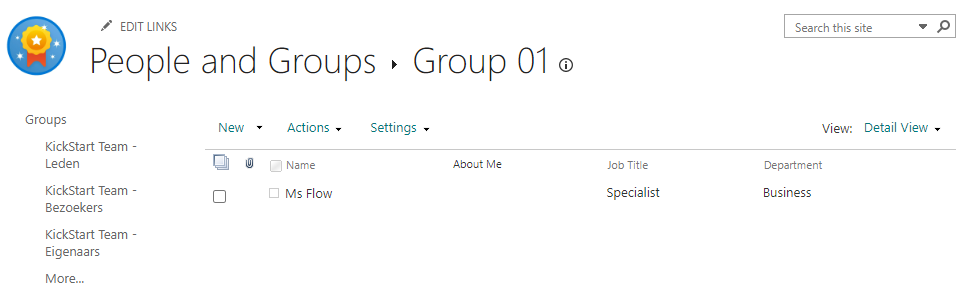

# SharePoint Group Creation with User added

## Summary

This sample creates a SharePoint Group in a SharePoint Site and it contains the pattern to immediately add a user to that newly created SharePoint Group. It will run manually using variables determined in the flow. Be sure to change these variables or even better: incorporate the pattern in a bigger automation solution 🤓.

## Applies to

*   [Microsoft Power Automate](https://docs.microsoft.com/power-automate/)

## Compatibility

## Authors

| Solution | Author(s) |
| --- | --- |
| sharepoint-group-creation-with-user-added | [Django Lohn](https://github.com/m3ngi3) ([@LohnDjango](https://www.twitter.com/LohnDjango) )

## Version history

| Version | Date | Comments |
| --- | --- | --- |
| 1.0.0.0 | May 31, 2022 | Initial release |

## Features

This sample demonstrates the following concepts:

*   Create a SharePoint Group in a SharePoint Site
*   Ensure an existing Azure Active Directory User to the SharePoint Site
*   Add the ensured User to the newly created SharePoint Group
*   All functionalities packed in an Unmanaged Power Platform Solution using Connection References and Environment Variables for a single-touch deployment to any Power Platform Environment by choice

## Minimal Path to Awesome

### Import Power Platform Solution

1.   Download the Power Platform solution found under the `solution` folder here: [Knowhere365 SharePoint Group Automation](./solution/Knowhere365SharePointGroupAutomation.zip)
1.   Import the Flow Solution into a Power Platform Environment by choice. Be aware that the current Power Platform Solution is of the Unmanaged kind: for more details on this kind of Solutions see [Solution concepts](https://docs.microsoft.com/en-us/power-platform/alm/solution-concepts-alm?WT.mc_id=DX-MVP-5004218).
1.   Select a **SharePoint Connection** for the Connection Reference: for more details on Connection References in Solutions see [Use a connection reference in a solution](https://docs.microsoft.com/en-us/power-apps/maker/data-platform/create-connection-reference?WT.mc_id=DX-MVP-5004218).
1.   Select a **SharePoint Site** for the Environment Variable: for more details on Environment Variables see [Environment variables overview](https://docs.microsoft.com/en-us/power-apps/maker/data-platform/environmentvariables?WT.mc_id=DX-MVP-5004218).

### Configure Flow

1. Once the solution is imported, edit it to fit your needs by changing the variables.

Depending on your updates a newly created SharePoint Group will look like: 
 
with at least one User in it: 
 

## Disclaimer

**THIS CODE IS PROVIDED** _**AS IS**_ **WITHOUT WARRANTY OF ANY KIND, EITHER EXPRESS OR IMPLIED, INCLUDING ANY IMPLIED WARRANTIES OF FITNESS FOR A PARTICULAR PURPOSE, MERCHANTABILITY, OR NON-INFRINGEMENT.**

## Help

We do not support samples, but we this community is always willing to help, and we want to improve these samples. We use GitHub to track issues, which makes it easy for  community members to volunteer their time and help resolve issues.

If you encounter any issues while using this sample, [create a new issue](https://github.com/pnp/powerautomate-samples/issues/new?assignees=&labels=Needs%3A+Triage+%3Amag%3A%2Ctype%3Abug-suspected&template=bug-report.yml&sample=YOURSAMPLENAME&authors=@LinkeD365&title=YOURSAMPLENAME%20-%20).

For questions regarding this sample, [create a new question](https://github.com/pnp/powerautomate-samples/issues/new?assignees=&labels=Needs%3A+Triage+%3Amag%3A%2Ctype%3Abug-suspected&template=question.yml&sample=YOURSAMPLENAME&authors=@LinkeD365&title=YOURSAMPLENAME%20-%20).

Finally, if you have an idea for improvement, [make a suggestion](https://github.com/pnp/powerautomate-samples/issues/new?assignees=&labels=Needs%3A+Triage+%3Amag%3A%2Ctype%3Abug-suspected&template=suggestion.yml&sample=YOURSAMPLENAME&authors=@LinkeD365&title=YOURSAMPLENAME%20-%20).

## For more information

- [Create your first flow](https://docs.microsoft.com/en-us/power-automate/getting-started#create-your-first-flow)
- [Microsoft Power Automate documentation](https://docs.microsoft.com/en-us/power-automate/)

