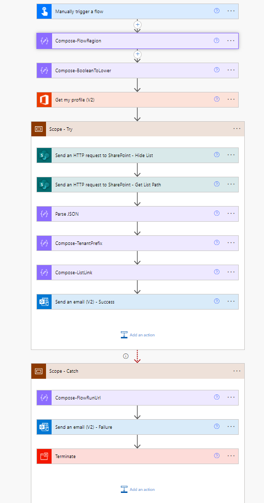
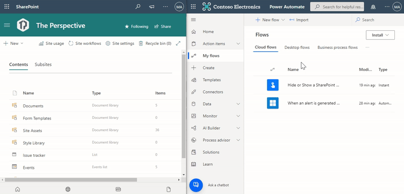
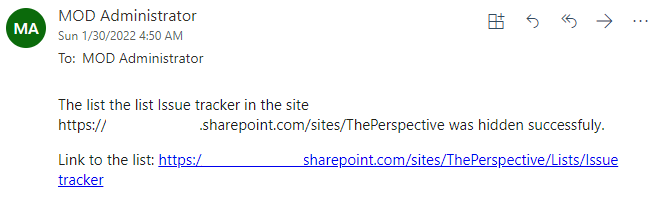
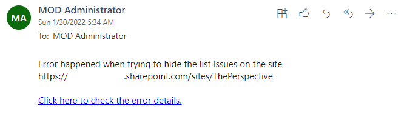
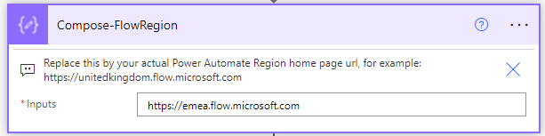

# Hide SharePoint Page Title

## Summary

Hides a SharePoint list from the site contents menu.

## Applies to

* [Microsoft Power Automate](https://docs.microsoft.com/power-automate/)

## Compatibility

> Don't worry about this section, we'll take care of it. Unless you really want to...

## Authors

Solution|Author(s)
--------|---------
sharepoint-hide-list-site-contents | [Michel Mendes](https://github.com/michelcarlo) ([@michelcarlo](https://twitter.com/michelcarlo))

## Version history

Version|Date|Comments
-------|----|--------
1.0|January 30, 2022|Initial release

## Features

Sometimes when building any solution based on SharePoint we need to hide a list from the site contents, for several reasons. The list can be creted with the intention to be used only by an automated solution and not updated or seen by users.
Even if we restrict permissions to read only in the list, this can cause some confusion in users.

Using SharePoint Designer we can mark a list as hidden from the site contents easily, and the same can also be done using PowerShell or SharePoint APIs.

But not all the time it's possible to use/install PowerShell or SharePoint Designer in our computers. And also it's important to bear in mind that SharePoint designer will be discontinued at some point in the near future.

This sample flow hides a list or makes a hidden list visible again using the SharePoint Rest API.

After a sucessful run, the user will get an email notification with the list link (in case it's needed to have it handy).

After a sucessful run, the user will get an email notification with the list link (in case it's needed to have it handy).

For failed runs, the link to the failed flow run will be sent to the user.

## Minimal Path to Awesome

* [Download](solution/sharepoint-hide-list.zip) the `.zip` from the `solution` folder
* [Import](https://flow.microsoft.com/en-us/blog/import-export-bap-packages/) the `.zip` file using **My Flows** > **Import** > **Upload** within Microsoft Flow.
* After the flow is imported, edit the below compose action to contain the path to your Power Automate home page url: 

You can also use SharePoint column formatting to call the same flow from other libraries:

## Disclaimer

**THIS CODE IS PROVIDED *AS IS* WITHOUT WARRANTY OF ANY KIND, EITHER EXPRESS OR IMPLIED, INCLUDING ANY IMPLIED WARRANTIES OF FITNESS FOR A PARTICULAR PURPOSE, MERCHANTABILITY, OR NON-INFRINGEMENT.**

## Help

> Note: don't worry about this section, we'll update the links.

We do not support samples, but we this community is always willing to help, and we want to improve these samples. We use GitHub to track issues, which makes it easy for  community members to volunteer their time and help resolve issues.

If you encounter any issues while using this sample, [create a new issue](https://github.com/pnp/powerautomate-samples/issues/new?assignees=&labels=Needs%3A+Triage+%3Amag%3A%2Ctype%3Abug-suspected&template=bug-report.yml&sample=YOURSAMPLENAME&authors=@YOURGITHUBUSERNAME&title=YOURSAMPLENAME%20-%20).

For questions regarding this sample, [create a new question](https://github.com/pnp/powerautomate-samples/issues/new?assignees=&labels=Needs%3A+Triage+%3Amag%3A%2Ctype%3Abug-suspected&template=question.yml&sample=YOURSAMPLENAME&authors=@YOURGITHUBUSERNAME&title=YOURSAMPLENAME%20-%20).

Finally, if you have an idea for improvement, [make a suggestion](https://github.com/pnp/powerautomate-samples/issues/new?assignees=&labels=Needs%3A+Triage+%3Amag%3A%2Ctype%3Abug-suspected&template=suggestion.yml&sample=YOURSAMPLENAME&authors=@YOURGITHUBUSERNAME&title=YOURSAMPLENAME%20-%20).

## For more information

- [Create your first flow](https://docs.microsoft.com/en-us/power-automate/getting-started#create-your-first-flow)
- [Microsoft Power Automate documentation](https://docs.microsoft.com/en-us/power-automate/)

---
