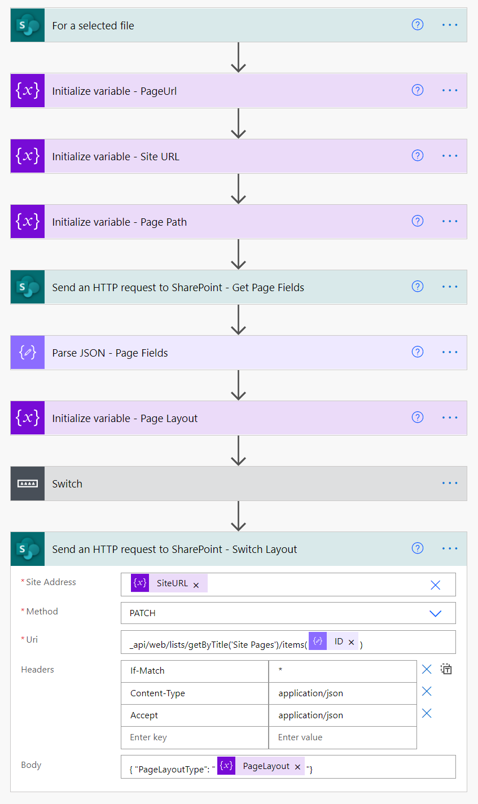
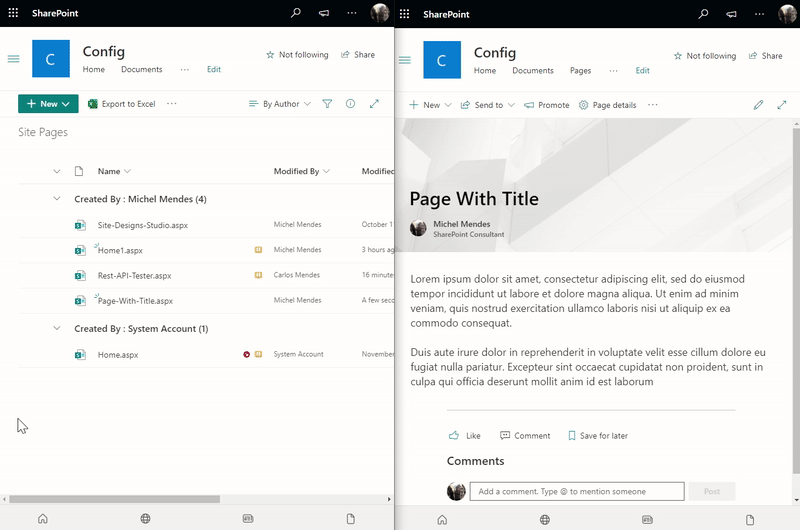

# Hide SharePoint Page Title

## Summary

Hides the SharePoint page title, and shows it back in case the flow is executed against the same page.

## Applies to

* [Microsoft Power Automate](https://docs.microsoft.com/power-automate/)

## Compatibility

## Authors

Solution|Author(s)
--------|---------
sharepoint-hide-page-title | [Michel Mendes](https://github.com/michelcarlo) ([@michelcarlo](https://twitter.com/michelcarlo))

## Version history

Version|Date|Comments
-------|----|--------
1.0|September 13, 2021|Initial release

## Features

For any SharePoint modern page that is created from the SharePoint UI, there will always be a page title which cannot be removed using the SharePoint UI at the moment.

There are known options to remove the page title using PnP PowerShell and Microsoft 365 CLI. The logic behind those options is that on the background they change a hidden field in the Page, which is the PageLayoutType field.

This field is not exposed through the UI but is accessible and editable through the SharePoint REST API. If the data is accessible and editable through the SharePoint REST API, we can manipulate it using a Power Automate flow.

This sample flow switches the page layout by updating the PageLayoutType field.

If it is a normal page (Article), this flow will switch it to a page with the 'Home' page layout (no title), and vice versa (in case there is a need to show the title again).

You can also use SharePoint column formatting to call the same flow from other libraries:

## Minimal Path to Awesome

* [Download](solution/switch-page-type.zip) the `.zip` from the `solution` folder
* [Import](https://flow.microsoft.com/en-us/blog/import-export-bap-packages/) the `.zip` file using **My Flows** > **Import** > **Upload** within Microsoft Flow.
* In the "Review Package Content" section, click the "Update" option for Import Setup on the Switch Page Type Resource and change it to New.
* After the flow is imported, edit the Flow trigger to point to a site in your tenant.
* Edit the Document library id to the Site Pages library id from the site you chose. The id can be found on the Library Settings page URL as a QueryString parameter:
 

> Note: If you want to reuse the same flow on other sites you can add the custom column formatting [JSON](solution/SwitchLayout_ColumnFormat.json) to a dummy column in the Site Pages library.

## Disclaimer

**THIS CODE IS PROVIDED *AS IS* WITHOUT WARRANTY OF ANY KIND, EITHER EXPRESS OR IMPLIED, INCLUDING ANY IMPLIED WARRANTIES OF FITNESS FOR A PARTICULAR PURPOSE, MERCHANTABILITY, OR NON-INFRINGEMENT.**

## Help

We do not support samples, but we this community is always willing to help, and we want to improve these samples. We use GitHub to track issues, which makes it easy for  community members to volunteer their time and help resolve issues.

If you encounter any issues while using this sample, [create a new issue](https://github.com/pnp/powerautomate-samples/issues/new?assignees=&labels=Needs%3A+Triage+%3Amag%3A%2Ctype%3Abug-suspected&template=bug-report.yml&sample=YOURSAMPLENAME&authors=@YOURGITHUBUSERNAME&title=YOURSAMPLENAME%20-%20).

For questions regarding this sample, [create a new question](https://github.com/pnp/powerautomate-samples/issues/new?assignees=&labels=Needs%3A+Triage+%3Amag%3A%2Ctype%3Abug-suspected&template=question.yml&sample=YOURSAMPLENAME&authors=@YOURGITHUBUSERNAME&title=YOURSAMPLENAME%20-%20).

Finally, if you have an idea for improvement, [make a suggestion](https://github.com/pnp/powerautomate-samples/issues/new?assignees=&labels=Needs%3A+Triage+%3Amag%3A%2Ctype%3Abug-suspected&template=suggestion.yml&sample=YOURSAMPLENAME&authors=@YOURGITHUBUSERNAME&title=YOURSAMPLENAME%20-%20).

## For more information

- [Create your first flow](https://docs.microsoft.com/en-us/power-automate/getting-started#create-your-first-flow)
- [Microsoft Power Automate documentation](https://docs.microsoft.com/en-us/power-automate/)
- [Working with the SharePoint HTTP Action in Power Automate](https://docs.microsoft.com/en-us/sharepoint/dev/business-apps/power-automate/guidance/working-with-send-sp-http-request)

---
