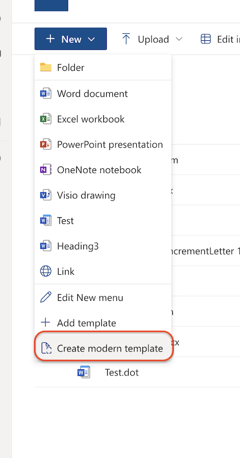

# Set item level permissions

## Summary

This sample demonstrates how to use the syntex content assembly feature via Power Automate. This feature helps us to create documents based on Modern Templates which is part of SharePoint Premium aka. Microsoft Syntex

## Applies to

* [Microsoft Power Automate](https://docs.microsoft.com/power-automate/)
* [SharePoint Content Assembly](https://learn.microsoft.com/en-us/microsoft-365/syntex/content-assembly)

## Compatibility

## Authors

Solution|Author(s)
--------|---------
sharepoint-premium-generate-documents-with-content-assembly | [Divya Akula](https://github.com/divya-akula) ([@_divyaakula](https://twitter.com/_divyaakula_))

## Version history

Version|Date|Comments
-------|----|--------

## Features

This sample demonstrates the following concepts:

* Get rows from excel
* Use the action generate document from Microsoft Syntex

## Prerequisites

This sample uses data from an excel which is part of the assets
* [Excel](assets/SalaryHikesFromExcel.xlsx)   
* [Syntex Modern Template](assets/DummySalaryIncrementLetter.docx) 
  
## Minimal Path to Awesome

* [Download](solution/GenerateDocumentsWithContentAssembly.zip) the `.zip` from the `solution` folder
* [Import](https://flow.microsoft.com/en-us/blog/import-export-bap-packages/) the `.zip` file using **My Flows** > **Import** > **Upload** within Microsoft Flow.
* In the "Review Package Content" section, click the "Update" option for Import Setup on the Switch Page Type Resource and change it to New.
* Once the flow is imported 

## Disclaimer

**THIS CODE IS PROVIDED *AS IS* WITHOUT WARRANTY OF ANY KIND, EITHER EXPRESS OR IMPLIED, INCLUDING ANY IMPLIED WARRANTIES OF FITNESS FOR A PARTICULAR PURPOSE, MERCHANTABILITY, OR NON-INFRINGEMENT.**

## Help

We do not support samples, but we this community is always willing to help, and we want to improve these samples. We use GitHub to track issues, which makes it easy for  community members to volunteer their time and help resolve issues.

If you encounter any issues while using this sample, [create a new issue](https://github.com/pnp/powerautomate-samples/issues/new?assignees=&labels=Needs%3A+Triage+%3Amag%3A%2Ctype%3Abug-suspected&template=bug-report.yml&sample=YOURSAMPLENAME&authors=@YOURGITHUBUSERNAME&title=YOURSAMPLENAME%20-%20).

For questions regarding this sample, [create a new question](https://github.com/pnp/powerautomate-samples/issues/new?assignees=&labels=Needs%3A+Triage+%3Amag%3A%2Ctype%3Abug-suspected&template=question.yml&sample=YOURSAMPLENAME&authors=@YOURGITHUBUSERNAME&title=YOURSAMPLENAME%20-%20).

Finally, if you have an idea for improvement, [make a suggestion](https://github.com/pnp/powerautomate-samples/issues/new?assignees=&labels=Needs%3A+Triage+%3Amag%3A%2Ctype%3Abug-suspected&template=suggestion.yml&sample=YOURSAMPLENAME&authors=@YOURGITHUBUSERNAME&title=YOURSAMPLENAME%20-%20).

## For more information

- [Create your first flow](https://docs.microsoft.com/en-us/power-automate/getting-started#create-your-first-flow)
- [Microsoft Power Automate documentation](https://docs.microsoft.com/en-us/power-automate/)
- [Working with the SharePoint HTTP Action in Power Automate](https://docs.microsoft.com/en-us/sharepoint/dev/business-apps/power-automate/guidance/working-with-send-sp-http-request)

---
