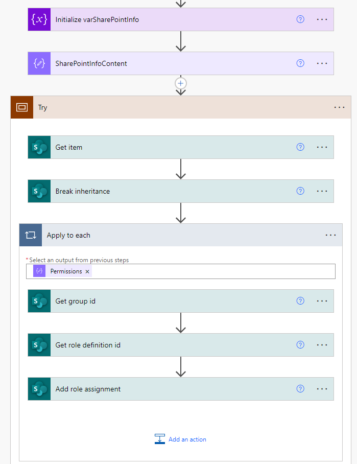

# Set item level permissions

## Summary

This sample demonstrates how to set list item level permissions.

## Applies to

* [Microsoft Power Automate](https://docs.microsoft.com/power-automate/)

## Compatibility

## Authors

Solution|Author(s)
--------|---------
sharepoint-set-item-level-permissions | [Ramin Ahmadi](https://github.com/ahmadiramin) ([@raminahmadi](https://twitter.com/raminahmadi1986))

## Version history

Version|Date|Comments
-------|----|--------
1.0|June 29, 2022|Initial release

## Features

This sample demonstrates the following concepts:

*   Get list item
*   Break role inheritance on the list item
*   Get the ID of the target group
*   Get the ID of the role definition that defines the permissions
*   Add the new role assignment for the groups on the list item

## Minimal Path to Awesome

* [Download](solution/SharePoint-Set-Item-Level-Permissions.zip) the `.zip` from the `solution` folder
* [Import](https://flow.microsoft.com/en-us/blog/import-export-bap-packages/) the `.zip` file using **My Flows** > **Import** > **Upload** within Microsoft Flow.
* In the "Review Package Content" section, click the "Update" option for Import Setup on the Switch Page Type Resource and change it to New.
* After the flow is imported, edit the **Initialize varSharePointInfo** action to update the site URL, list name, item Id, and the permissions.

## Disclaimer

**THIS CODE IS PROVIDED *AS IS* WITHOUT WARRANTY OF ANY KIND, EITHER EXPRESS OR IMPLIED, INCLUDING ANY IMPLIED WARRANTIES OF FITNESS FOR A PARTICULAR PURPOSE, MERCHANTABILITY, OR NON-INFRINGEMENT.**

## Help

We do not support samples, but we this community is always willing to help, and we want to improve these samples. We use GitHub to track issues, which makes it easy for  community members to volunteer their time and help resolve issues.

If you encounter any issues while using this sample, [create a new issue](https://github.com/pnp/powerautomate-samples/issues/new?assignees=&labels=Needs%3A+Triage+%3Amag%3A%2Ctype%3Abug-suspected&template=bug-report.yml&sample=YOURSAMPLENAME&authors=@YOURGITHUBUSERNAME&title=YOURSAMPLENAME%20-%20).

For questions regarding this sample, [create a new question](https://github.com/pnp/powerautomate-samples/issues/new?assignees=&labels=Needs%3A+Triage+%3Amag%3A%2Ctype%3Abug-suspected&template=question.yml&sample=YOURSAMPLENAME&authors=@YOURGITHUBUSERNAME&title=YOURSAMPLENAME%20-%20).

Finally, if you have an idea for improvement, [make a suggestion](https://github.com/pnp/powerautomate-samples/issues/new?assignees=&labels=Needs%3A+Triage+%3Amag%3A%2Ctype%3Abug-suspected&template=suggestion.yml&sample=YOURSAMPLENAME&authors=@YOURGITHUBUSERNAME&title=YOURSAMPLENAME%20-%20).

## For more information

- [Create your first flow](https://docs.microsoft.com/en-us/power-automate/getting-started#create-your-first-flow)
- [Microsoft Power Automate documentation](https://docs.microsoft.com/en-us/power-automate/)
- [Working with the SharePoint HTTP Action in Power Automate](https://docs.microsoft.com/en-us/sharepoint/dev/business-apps/power-automate/guidance/working-with-send-sp-http-request)

---
