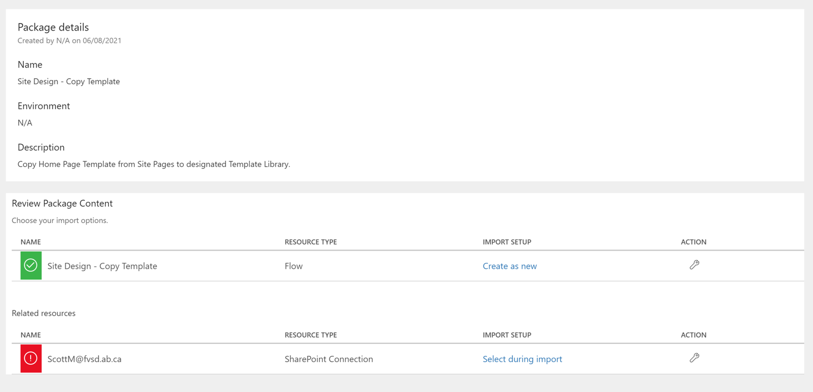
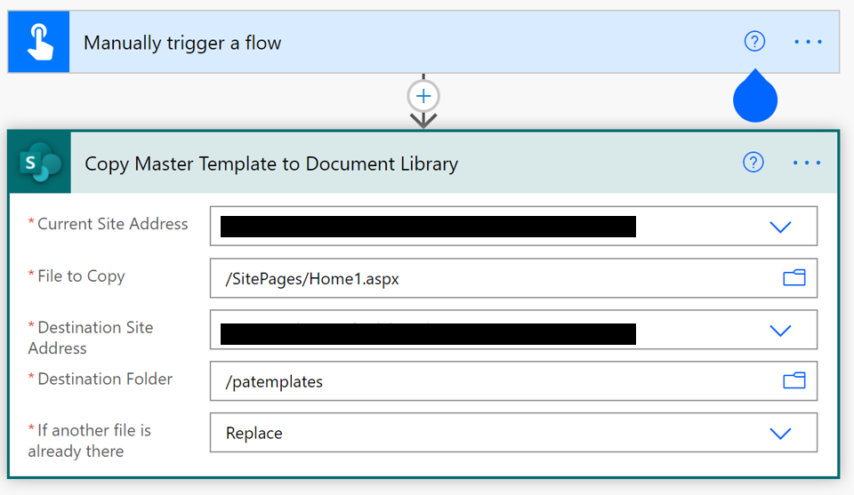
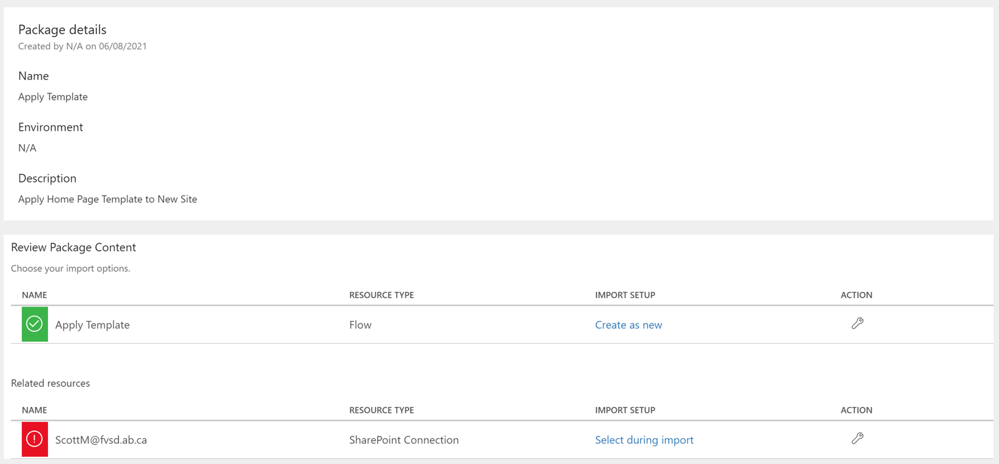
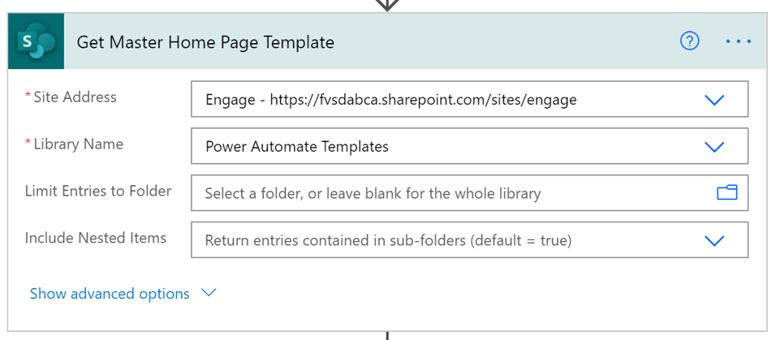
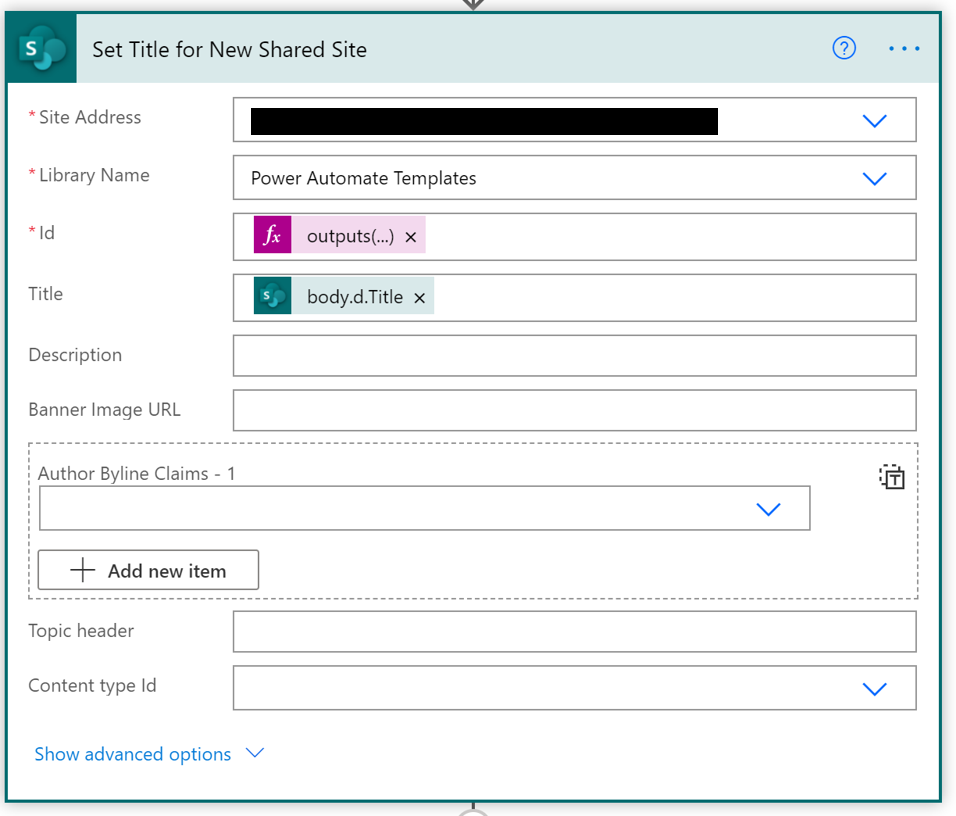
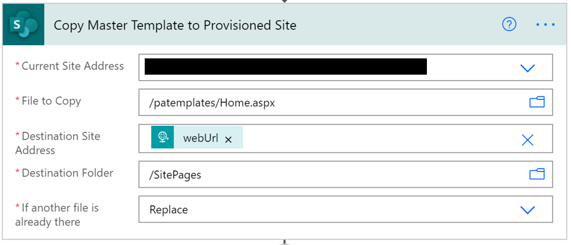
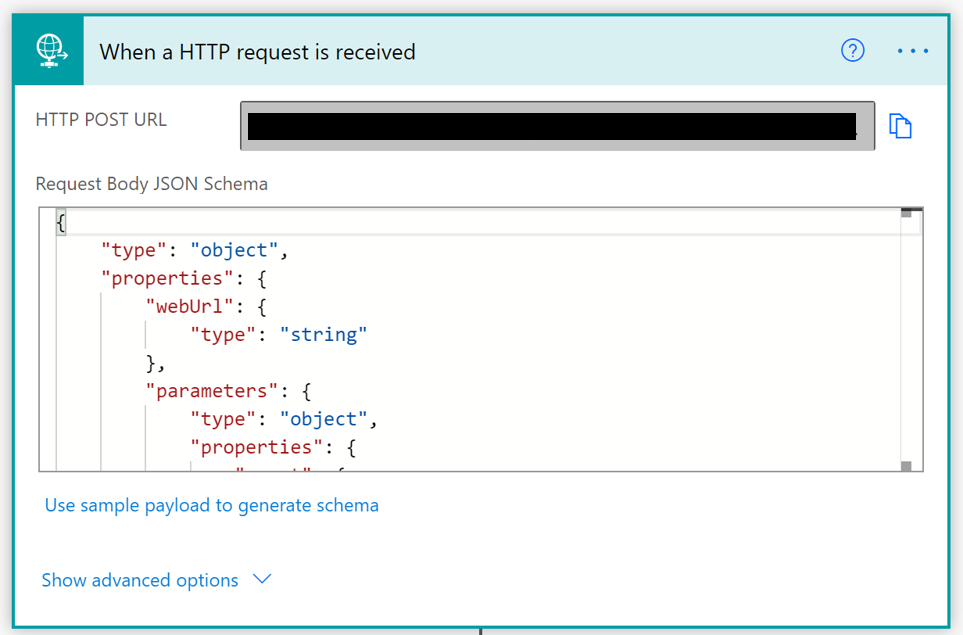
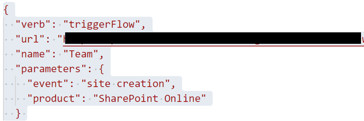

# Set Home Page Template after Site Design is applied

## Summary

This will set a Home page with Web Parts on a newly created Site using a Site Design 

## Applies to

*   [Microsoft Power Automate](https://docs.microsoft.com/power-automate/)

## Compatibility

## Authors

| Solution | Author(s) |
| --- | --- |
| site-design-homepage | [Scott McKenzie](https://github.com/skmckenFVSD) ([@365EDUBI](https://twitter.com/365EDUBI) )

## Version history

| Version | Date | Comments |
| --- | --- | --- |
| 1.0 | June 6, 2021 | Initial release |

## Features

This sample demonstrates the following concepts:

* Copy Template from Site Pages to Template Library
* Receive request from Site Design activation.
* Copy Template to Site with Design activation.
* Publish template as Home Page.

## Minimal Path to Awesome
* [Download](solution/CopyTemplate.zip) the `CopyTemplate.zip` from the `solution` folder
* [Download](solution/ApplyTemplate.zip) the `ApplyTemplate.zip` from the `solution` folder
* [Import](https://flow.microsoft.com/en-us/blog/import-export-bap-packages/) the `CopyTemplate.zip` and `ApplyTemplate.zip`file using **My Flows** > **Import** > **Upload** within Microsoft Flow.

### Create Home Page Template

Before you can use this sample flow, you'll need to create a Home Page Template and Library to hold your template.

* Create new Web Page Template in any site you have access to.
* Create new document library in an existing site to store the template in.

### Import Copy Template Solution

1.   Download the solution found under the `solution` folder
1.   Import the Flow Solution. Open  [https://flow.microsoft.com/](https://flow.microsoft.com/). Open **My Flows**, **Import**.
1.   Browse to the file you downloaded and select **Upload**.
1.   In the **Import package** screen, select the **SharePoint Connection**, under **Related Resources** and use the **Select during import** to select an existing connection or create a new SharePoint connection.
     
1.   Once complete, select **Import**.

### Configure Copy Template Flow

1. Once the solution is imported, edit it
1. Select the **Copy Master Template to Document Library** action and replace the ***Current Site Address*** and the ***File to Copy*** to point to your Home Page Template as well as the  ***Destination Site Address*** and the ***Destination Folder*** to point to your Template Library
   
1. Save your flow and run it.
1. Open **Template Library** and rename copied file to ***Home.aspx***.

### Import Apply Template Solution

1.   Download the solution found under the `solution` folder
1.   Import the Flow Solution. Open  [https://flow.microsoft.com/](https://flow.microsoft.com/). Open **My Flows**, **Import**.
1.   Browse to the file you downloaded and select **Upload**.
1.   In the **Import package** screen, select the **SharePoint Connection**, under **Related Resources** and use the **Select during import** to select an existing connection or create a new SharePoint connection.
     
1.   Once complete, select **Import**.

### Configure Apply Template Flow

1. Once the solution is imported, edit it
1. Select the **Get Master Home Page Template** action and replace the ***Site Address*** and the ***Library Name*** to point to your Home Page Template Library.
   
1. Select the **Set Title for New Shared Site** action and replace the ***Site Address*** and the ***Library Name*** to point to your Home Page Template Library.
   
1. Select the **Copy Master Template to Provisioned Site** action and replace the ***Site Address*** and the ***Library Name*** to point to your Home Page Template Library.
   
1. Select the **When a HTTP request is recieved** trigger and copy the ***HTTP Post URL***.
         
1. Save your flow.

### Add HTTP Post URl to Site Design
1. Add ***triggerFlow*** verb to Site Design Script replacing ***url*** with previously copied ***HTTP Post URL***.
         

## Disclaimer

**THIS CODE IS PROVIDED** _**AS IS**_ **WITHOUT WARRANTY OF ANY KIND, EITHER EXPRESS OR IMPLIED, INCLUDING ANY IMPLIED WARRANTIES OF FITNESS FOR A PARTICULAR PURPOSE, MERCHANTABILITY, OR NON-INFRINGEMENT.**

## Support

While we don't support samples, if you encounter any issues while using this sample, you can [create a new issue](https://github.com/pnp/powerautomate-samples/issues/new?assignees=&labels=Needs%3A+Triage+%3Amag%3A%2Ctype%3Abug-suspected&template=bug-report.yml&sample=YOURSAMPLENAME&authors=@LinkeD365&title=YOURSAMPLENAME%20-%20).

For questions regarding this sample, [create a new question](https://github.com/pnp/powerautomate-samples/issues/new?assignees=&labels=Needs%3A+Triage+%3Amag%3A%2Ctype%3Abug-suspected&template=question.yml&sample=YOURSAMPLENAME&authors=@LinkeD365&title=YOURSAMPLENAME%20-%20).

Finally, if you have an idea for improvement, [make a suggestion](https://github.com/pnp/powerautomate-samples/issues/new?assignees=&labels=Needs%3A+Triage+%3Amag%3A%2Ctype%3Abug-suspected&template=suggestion.yml&sample=YOURSAMPLENAME&authors=@LinkeD365&title=YOURSAMPLENAME%20-%20).

## For more information

- [Create your first flow](https://docs.microsoft.com/en-us/power-automate/getting-started#create-your-first-flow)
- [Microsoft Power Automate documentation](https://docs.microsoft.com/en-us/power-automate/)

